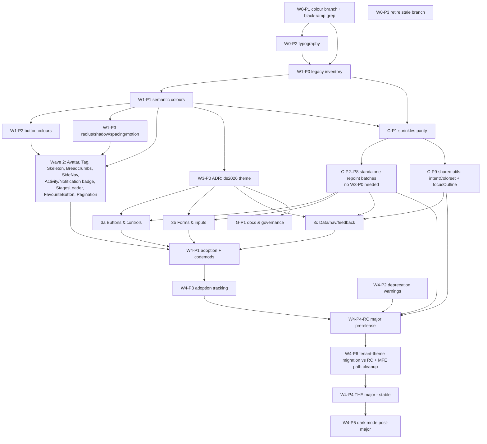

# Overdrive → Design System 2026 Migration Plan

> **Status:** Proposed — grounded in a measured survey of the MFE consumer monorepo (100 apps / 201 packages, all pinned to overdrive `4.59.0`).
> **Author:** Migration planning · **Date:** 2026-07-07
> **Repo:** `@autoguru/overdrive` @ `4.59.0` · **Figma:** "AutoGuru Design System 2026" (file key `ZkQlQcJkF7NTnZomVrPRN5`)
> **Audience:** engineering leads (decisions/risk/sequencing) **and** AI-agent orchestrators + Sonnet-class builder agents who will execute this file with **only repo access and this document** — no access to Figma, the research notes, or any chat. Everything an executor needs is inlined here.

---

## 0. How to use this document (orchestrator guide)

You are an orchestrator with a team of less-capable builder/reviewer/verify agents. To execute this plan:

1. **Pick the next unblocked work package.** Consult the dependency table (§5.2) and the tracking table (§9). A package is unblocked when every package in its "Depends on" list is ticked Done.
2. **Read the package's work order** (§4). It contains: exact files to create/modify, the target API/token shape as literal TypeScript, a step-by-step sequence, and done-criteria.
3. **Spawn the agents** (triad for token-only packages; quad Spec→Builder→Reviewer→Verify for Wave-2/3 component packages — §4.0.2) using the copy-paste prompts. Each package either embeds its prompts inline (see the wave files), or gives a "prompt data row" that you paste into the reusable templates in §4.0.2. The prompts are self-contained — they restate the additive-only rule and embed the token values needed.
4. **Run the verification gates** (§4.0.1) via the Verify agent. Do not proceed on red.
5. **Release** per the mechanical procedure in Appendix A.
6. **Tick the tracking table** (§9) and pick the next package.

**Detailed wave execution plans.** Each wave has a fully-executable companion file under `docs/ds2026-plan/`, grounded in the real repo/MFE and individually reviewed:
- [`docs/ds2026-plan/wave-0.md`](docs/ds2026-plan/wave-0.md) — W0-P1/P2/P3 work orders with git mechanics, filled agent prompts, and the verified merge-tree analysis of the two in-flight branches.
- [`docs/ds2026-plan/wave-1.md`](docs/ds2026-plan/wave-1.md) — W1-P0…P3 token-foundation work orders with exact contract/base-token blocks and DO-NOT lists.
- [`docs/ds2026-plan/wave-2.md`](docs/ds2026-plan/wave-2.md) — the net-new-component playbook (scaffold, skeletons, semantic-tokens-only rule) + per-package sections W2-P1…P10.
- [`docs/ds2026-plan/wave-3.md`](docs/ds2026-plan/wave-3.md) — W3-P0 ADR skeleton + `ds2026` theme scaffold code + per-component restyle work orders (3a/3b/3c).
- [`docs/ds2026-plan/track-c.md`](docs/ds2026-plan/track-c.md) — C-P1 sprinkles pivot + the **authoritative measured legacy inventory** + standalone repoint batches C-P2…C-P9.
- [`docs/ds2026-plan/wave-4.md`](docs/ds2026-plan/wave-4.md) — adoption codemods, deprecation warnings, adoption telemetry, tenant-theme migration, the major, G-P1 governance, W4-P5 dark mode.

**Precedence rule:** this master owns principles, rules, and dependencies; the wave files own per-package work orders and embedded agent prompts. Where a wave file corrects a master assumption, the correction is logged in that file's "Deviations & open items" section and reconciled back into this master (this document reflects all reconciliations to date).

**Golden rule for every package before the final major (Wave 4 W4-P4):** the change must be *additive*. Never change the value of an existing token key, never rename/remove an existing token key, never change a component's default prop values or prop semantics, never rename/remove a component directory. New capability arrives only as (a) new token keys, (b) new prop *values* with legacy defaults preserved, or (c) the new opt-in `ds2026` theme. If a change cannot be made additively, it belongs in Wave 4's single major, not before.

> **EXCEPTION (Track C only):** a semantic `color.*` key **introduced by Wave 1** MAY be revalued in `base/tokens.ts` per the §4.C value-split rule PROVIDED the package proves **(a)** zero MFE usage of that key (grep the mfe repo for the key path — record the grep output in the PR) and **(b)** Chromatic base-theme zero-diff. Legacy `colours.*`, `space`, `radius`, `elevation` 1–5, and typography keys are **NEVER** revalued — no exception.

### 0.1 The MFE consumer reality (drives every opt-in decision)
The consumer is **one Bun/yarn-workspace monorepo** (`/Users/timamehro/grit/github.com/autoguru/mfe`): 100 apps + 201 packages, 34 `package.json` depend on overdrive, **all resolving to exactly `4.59.0` (single `bun.lock` entry)**. Overdrive upgrades are **manual — no renovate/dependabot**; `@autoguru/icons` pinned `2.2.0`. Because there is one lockfile, a published overdrive minor reaches **all 100 apps at once** when the monorepo bumps — which is precisely why every pre-major wave must be additive (a minor lands monorepo-wide simultaneously) and opt-in must be per-app / per-component *within* that single version.

Load-bearing measured facts (cited throughout):
- **Imports:** 2,982 barrel imports; 631 deep imports — of which `themes/theme.css` (the token contract) is imported by **334 files** (`themeContractVars as vars` = 325 occurrences). The token contract is the single most-imported deep path.
- **Token usage:** legacy `colours.*` referenced **390 times** vs the new semantic `color.*` **exactly once**; `vars.space[...]` **556 times** (silent-failure surface — no compile error on value drift); `border.radius.*` 46; `elevation` 20 (incl. 10 tenant-theme unit tests asserting **exact** elevation values); `typography.*` 86.
- **Components:** Box 2,928 · Text 2,443 · Stack 1,760 · Button 576 (`variant=` in 407 files: secondary 276, primary 240, danger 24, warning 7, success 5, information 3; **`rounded=` exactly once**).
- **Theming:** `OverdriveProvider` mounted in **99 files, one per app**, theme selection scattered per-app (most ride default base, no explicit `theme=`); **`ThemeOverrideProvider` used ZERO times**. Four **tenant theme packages** (`smartFleetTheme`, `ampolTheme`, `fleetGuruTheme`, `dynamicGuruTheme`) + `apps/cb-portal` + `apps/ag-merchant-finder` build on `makeTheme` internals (`buildColourGamut`, `breakpoints`, types `ColourMap`/`ThemeTokens`) — **de-facto public API**.
- **Style utils:** `useTextStyles` 422, `useBoxStyles` 347, `textStyles` 199, overdrive `sprinkles` **1 file**.
- **Fragile imports to clean up:** 2 files import internal `lib/theme/tokens/{render,facade}`; 1 imports `dist/themes/theme.css` — no stability guarantee (Wave-4 MFE cleanup item).

---

## 1. Executive summary

Overdrive is AutoGuru's React + Vanilla-Extract component library, shipped to npm and consumed by many MFE apps. We are taking it to full feature-parity with the Design System 2026 (DS-2026) Figma spec — every component, variant and token — **gradually and additively, never as a big-bang major.**

The hard constraint (product owner Tima; precedent: the rejected global change AG-19972): **no live MFE screen may shift a pixel or a behaviour until one final major release at the very end.** The release pipeline (changesets → Version Packages PR → auto-publish) has **no partial-rollout mechanism**, so opt-in must live in the API/token design, not in release engineering. Every wave before the last is a **minor** release, independently publishable and adoptable in MFE production.

Delivery is five waves plus one cross-cutting track:

| Wave / Track | What | Release |
|---|---|---|
| **Wave 0** — Consolidate in-flight work | Land the colour-ramp branch (+ black-ramp blast-radius check), reconcile + land the typography branch, retire the stale palette branch. | minor / none |
| **Wave 1** — Complete the token foundation | Add the full DS-2026 semantic `color.*` layer, radius/shadow/spacing/motion keys — all as new keys. Legacy `colours.*` untouched. | minor |
| **Wave 2** — Net-new components | Avatar, Tag, Skeleton, Breadcrumbs, SideNav, ActivityBadge, NotificationBadge, StagesLoader, FavouriteButton, Pagination picker. Zero MFE risk. | minor (per component) |
| **Wave 3** — Opt-in restyles | ADR chooses the opt-in vehicle (`ds2026` theme + new prop values); then per-component restyles behind it. Existing screens pixel-identical by default. | minor (per component) |
| **Track C** — Colour internalisation (cross-cutting, Waves 1→4) | Move all ~80 components off the legacy `colours.*` / `typography.colour` / `sprinklesLegacyText` contract onto the semantic `color.*` layer, using value-preserving repoints (base theme identical pixels; `ds2026` carries the real 2026 values). | minor (per component) |
| **Wave 4** — Adoption + the single major | Adoption guide + codemods (app-level theme swap across 99 mount points; `variant`→`class` in 407 files), deprecation warnings, adoption tracking, tenant-theme migration (4 packages on `makeTheme` internals), then **one** major that flips defaults, deletes the dual colour system, removes deprecated keys. Dark mode is a named post-major follow-on. | **major** |

**End state:** a single semantic token contract, full DS-2026 component parity, legacy system removed, dark-mode-ready — reached without breaking a live MFE screen before the final major.

---

## 2. Current-state snapshot

### 2.1 Version & release pipeline
- `@autoguru/overdrive` **4.59.0**, versioned by **changesets**.
- Flow: PR + changeset → merge to `main` → `release.yml` opens a **"Version Packages" PR** → merging that updates `CHANGELOG.md` → `publish.yml` runs `yarn changeset publish` → npm via OIDC Trusted Publishing → git tags + GitHub releases + Storybook to GitHub Pages.
- `prerelease.yml` (manual `workflow_dispatch`, needs `.changeset/pre.json`) can publish npm prerelease tags — the only lever to let the MFE trial a wave before the stable tag.
- **No wave-tagging / partial-rollout.** Every merged changeset ships in the next version. Opt-in must be API-level.

### 2.2 Token / theme architecture (verified in repo)
- `lib/themes/theme.css.ts:78-351` defines `THEME_CONTRACT` via `createGlobalThemeContract`, exported as **`overdriveTokens`** (alias `themeContractVars`) and re-exported publicly as **`tokens`** (`lib/index.ts`). The whole contract of CSS-var names is public API.
- Mapper (`theme.css.ts:356-360`): a `null` contract leaf still emits a path-derived var name (`od-<path>`); whether it *resolves* depends on whether a theme's `tokens.ts` assigns a value. The header comment claiming null vars "do not exist" is misleading — do not rely on it.
- **Two parallel colour systems coexist:**
  - **Legacy `colours.*`** — `gamut` / `foreground` / `background` / `intent` (intent = primary, brand, secondary, shine, danger, warning, neutral, success, information; each `background.{standard,mild,strong}` + `foreground` + `border`). This is what components render today, **directly and transitively through sprinkles** (see §2.4).
  - **Semantic `color.*`** (2025, incomplete) — `gamut` / `surface` / `content` / `interactive`. Already populated in `base/tokens.ts:36-70` (`surface.page=white`, `content.normal=gray900`, `interactive.*` wired) and consumed by the newer sprinkles `color`/`backgroundColor` properties. Lacks the Figma namespaces (foreground/background/border/info/success/warning/alert/button) that Wave 1 adds.
- **Themes:** `base`, `flat_red`, `neutral` only (`lib/themes/index.ts`). Each dir = `tokens.ts` (`satisfies ThemeTokens`) + `theme.css.ts` (`createTheme` → class; base also `createGlobalTheme` on `:root, [data-od-theme=base], [data-od-theme=base][data-od-color-mode=light]`, `base/theme.css.ts:9-14`) + `index.ts` exporting `{ name, themeRef, vars, tokens }`.
- **Verified current base values** (`base/tokens.ts`):
  - `space`: `1`=4px, `2`=8, `3`=12, `4`=16, `5`=20, `6`=24, `7`=32, `8`=48, `9`=96, `none`=0. (Jump 48→96 — no 64/80.)
  - `border.radius`: `none`, `min`=2, `sm`=4, `md`=8, `lg`=12, `xl`=16, `2xl`=24, `1`=4, `pill`=`1e9`px, `full`=50%. (`sm` & `1` both 4px — redundant.)
  - `border.width`: `none`=0, `1`=1px, `2`=2px, `3`=4px.
  - `elevation`: `none`, `1`–`5` (box-shadow strings; `flat_red` zeroes them).
  - `typography.fontWeight`: `normal`=400, `semiBold`=**500**, `bold`=700.
  - `typography.size` `1`–`9` (fontSize/lineHeight pairs only; no named h/p styles until W0-P2).

### 2.3 Component inventory (verified)
- `lib/components/` = 81 dirs. **Confirmed absent (net-new):** Avatar, Tag, Skeleton, SideNav, Breadcrumbs, ActivityBadge, StagesLoader, HeartButton/FavouriteButton, standalone NotificationBadge.
- **Button** (`Button/Button.css.ts`): `variant`→`intent` ∈ {primary, brand, secondary, danger, information, warning, success}; `size` ∈ {xsmall, small, medium} (default **medium**); `shape` ∈ {default, rounded, iconOnly}. **Default `borderRadius:'md'` (8px)** (`Button.css.ts:33`); `rounded` prop → `borderRadius:'pill'` (`:223-225`). `defaultVariants` (`:410-415`): size medium, shape default, intent primary, minimal false. Also `minimal`, `isFullWidth`, `isLoading`, `withDoubleClicks`.
- Badge (`look` standard/inverted, `size` standard default), TextInput (`withEnhancedInput` over `private/InputBase`), Tabs (compound; `appearance` underlined/pill/minimal), Tooltip, Alert (`intent` danger/information/success/warning; still on `typography.colour`/`sprinklesLegacyText`).

### 2.4 MFE coupling surface (blast radius — measured)
- **`exports` map is granular** (`package.json`): `.`, `./components/*`, `./components/*/default`, `./hooks`, `./hooks/*`, `./styles`, `./styles/*`, `./themes`, `./themes/base|flat_red|neutral`, `./themes/*`, `./utils`, `./utils/*`, `./dist/*`. Deep imports are real (631) but component deep-imports are a **narrow set** — Positioner 55, AutoSuggest 32, HintText 8, DatePicker/Calendar/DataTable/Toaster/OptionGrid 2–4. Renaming those specific dirs breaks MFEs; the long tail is barrel-only.
- **The token contract is heavily public.** `themeContractVars as vars` is imported from `./themes/theme.css` by **334 files / 325 occurrences** — the single most-imported deep path. Any renamed/removed contract key breaks compile across the monorepo. This is why Wave 1 is strictly additive and removals wait for the major.
- **`makeTheme` internals are de-facto public API.** 4 tenant theme packages import `buildColourGamut`, `breakpoints`, and the types `ColourMap`/`ThemeTokens` from `./themes/makeTheme` + `./themes` to hand-roll full custom gamuts; their unit tests assert **exact `elevation` values**. Any change to these *type shapes* or to existing elevation *values* breaks them at compile/test time even with the public token contract otherwise stable (see R10; tenant-theme migration package in Wave 4).
- **Breaking-change sensitivity ranking (measured):** (1) **`vars.space[...]` — 556 refs, silent-failure** (value drift = layout shift, no compile error) → never renumber/revalue space keys; (2) **legacy `colours.*` — 390 refs** (grays dominate: gray200 50, gray900 36, gray300 35, gray100 29) vs `color.*` **1 ref** → legacy keys/values stable until the major; (3) **Box/Text/Stack JSX volume (2,928 / 2,443 / 1,760)** → any default-prop visual change on these three has the widest reach; (4) **`typography.size` + `border.radius` (86 + 46)** → radius key renames (`md`/`lg`/`pill`/`2xl`/`sm`) hit real sites, incl. `borderRadius="pill"` on Box; (5) **4 tenant theme packages on `makeTheme` internals** → low count, highest structural fragility.
- **sprinkles is bound to legacy tokens** (`lib/styles/sprinkles.css.ts:35-74` → `tokens.colours.*`; new props `:57-61,125-130` → `color.*`). MFEs barely use overdrive `sprinkles` directly (**1 file**) but use `useTextStyles` (422) / `useBoxStyles` (347) heavily — those resolve through the same token layers.
- `sideEffects` array (8 entries) marks `.css.ts`/theme/global files — tree-shaking correctness matters in refactors.
- **peerDeps** include `@autoguru/icons >= 2.0.0` (MFE pins `2.2.0`, manual upgrades), react 18/19, react-aria, vanilla-extract packages, colord, es-toolkit, popperjs, clsx.
- **Provider mounting:** 99 mount points, one per app, scattered (no central wrapper); `ThemeOverrideProvider` unused. Opt-in must therefore be **per-app theme swap** (99 mechanical, codemod-able sites) + **per-component new prop values** (W3-P0).

### 2.5 What has landed vs in-flight
| State | Item |
|---|---|
| **On `main`** | Icons 2.0.1/2.1.0 (Phosphor) — iconography **done** (OU-6). SplitButton, DataTable, build/publish infra. No other DS-2026 work. |
| **`feature/AG-19959-overdrive-colour`** (25 ahead of `main`) | DS-2026 colour ramps in `base/colours.ts`; semantic text tokens repointed to AA shades; **black ramp removed** from `color.gamut` + `Colours` type; gray ramp inlined (base/flat_red/neutral); DS-2026 contrast guide + "Theme Colours 2026" Storybook page. Repo grep for `gamut.black` in `lib/` is clean. |
| **`AG-19972-typography`** (local + origin, unmerged) | `TEXT_STYLES` + `namedTextStyleMap` (h1–h4 bold, p1–p4 normal) in `lib/styles/typography.ts`; `TypographyProps.size` extended; +34 `base/tokens.ts`, +33 `theme.css.ts`, typography stories/mdx. **Touches the same two files as AG-19959 → reconcile in W0-P2.** |
| **`feat/design-system-2026-palette`** (`ce274ca9`) | Stale — deletes SplitButton + `iconCategories.ts`, predates icons 2.0. **Retire (W0-P3).** |
| **`poc-dark-mode`** (PR #1297) | `[data-od-color-mode=dark]` + `createGlobalTheme`. Base theme already has the `light` selector (`base/theme.css.ts:10`). **Post-Wave-4 (W4-P5).** |

---

## 3. Guiding principles

1. **Additive/opt-in until the final major** (see §0 Golden rule).
2. **A wave = a releasable minor.** Opt-in via API design, never release engineering.
3. **Figma *variables*, not swatch *labels*.** Use the hex tables in §3.1 (sourced from bound variables). Several swatch labels are stale; the variable tables here are authoritative. Any conflict → §6 open question, never a silent choice.
4. **Value-preserving repoints (Track C).** See §4.C for the exact value-split rule.
5. **Verification gates are per-package** (§4.0.1). **Snapshot-churn gotcha:** any token/style edit renumbers Vanilla-Extract class `__hash` suffixes → mass snapshot diffs that are *style-identical*. Confirm by stripping `__hash` suffixes and re-diffing (procedure in §4.0.1) before concluding a diff is real.
6. **Legacy stays alive until the major.** Internal migration (Track C) and public deprecation/removal (Wave 4) are separate, separately-sequenced steps.
7. **One new system, not a third.** Complete the existing semantic `color.*` layer; do not invent a parallel scheme.
8. **Every wave/package release is independently publishable AND independently verifiable in the MFE.** Each wave file carries a Post-release MFE verification checklist (pre-publish `yarn overdrive:local` smoke; post-publish throwaway-branch bump + adoption/regression probes; tenant-theme guard; single-`bun.lock` pin-back rollback). A package is not Done until its MFE verification passes.

### 3.1 Inlined DS-2026 token reference (authoritative — executors use these, not Figma)

**All hex below are bound-variable values.** Where a drawn swatch label differs it is noted; use the variable value.

**Colour ramps (`color.gamut.*`, already adopted on `feature/AG-19959-overdrive-colour`):**

| Grade | Grey | Green | Blue | Yellow | Red |
|---|---|---|---|---|---|
| 900 | `#212338` | `#00574C` (label `#078171`✗) | `#0D47A1` | `#F38E29` | `#780502` |
| 800 | `#34384C` | `#18856F` (label `#05987a`✗) | `#0D4BB7` | `#F69A1F` | `#96110E` |
| 700 | `#484C5F` | `#03AF83` | `#0D50CE` | `#F9A715` | `#B51E1A` |
| 600 | `#5C6172` | `#01C68C` | `#0D54E5` | `#FCB30B` | `#D42B26` |
| 500 | `#6C7283` | `#00DDA5` (label `#00dd95`✗) | `#0D59FC` | `#FFC001` | `#E12E28` |
| 400 | `#8F95A1` | `#36E5AA` | `#4A86FF` (label `#4680fc`✗) | `#FFCF3D` | `#E85F5B` |
| 300 | `#D4D9DD` | `#71EDC2` | `#81AFFF` (label `#80a7fd`✗) | `#FFDE79` | `#EF918E` |
| 200 | `#EEF0F2` | `#E3F8F0` | `#BAD4FF` (label `#e1edfe`✗ — largest divergence) | `#FFEDB5` | `#FFD4D4` |
| 100 | `#FAFBFC` | `#F2FDF9` | `#F3F8FF` | `#FFFCF2` | `#FDF4F4` |

White `#FFFFFF`. ✗ = swatch label disagrees with the variable — **use the variable (left value)**; confirm via §6-Q1 but proceed on the variable.

**Semantic colour tokens (Figma → code key → hex):**

| Figma path | Code key | Hex |
|---|---|---|
| color/foreground/primary | `color.foreground.primary` | `#212338` |
| color/foreground/secondary | `color.foreground.secondary` | `#484C5F` |
| color/foreground/reverse | `color.foreground.reverse` | `#FFFFFF` |
| color/foreground/tertiary\inactive | `color.foreground.tertiaryInactive` | `#8F95A1` |
| color/foreground/tertiary\inactive-light | `color.foreground.tertiaryInactiveLight` | `#D4D9DD` |
| color/background/default | `color.background.default` | `#FFFFFF` |
| color/background/reverse | `color.background.reverse` | `#212338` |
| color/background/inactive | `color.background.inactive` | `#D4D9DD` |
| color/background/emphasis\inactive | `color.background.emphasisInactive` | `#EEF0F2` |
| color/border+hairline/default | `color.border.default` | `#D4D9DD` |
| color/border+hairline/emphasis | `color.border.emphasis` | `#8F95A1` |
| color/border+hairline/selected | `color.border.selected` | `#5C6172` |
| color/border+hairline/strong | `color.border.strong` | `#212338` |
| color/info/text | `color.info.text` | `#0D47A1` |
| color/info/foreground | `color.info.foreground` | `#0D54E5` |
| color/info/background | `color.info.background` | `#E1EDFE` |
| color/success/text | `color.success.text` | `#00574C` |
| color/success/foreground | `color.success.foreground` | `#01C68C` |
| color/success/background\dark | `color.success.backgroundDark` | `#18856F` |
| color/success/background\light | `color.success.backgroundLight` | `#E3F8F0` |
| color/warning/text | `color.warning.text` | `#96110E` |
| color/warning/foreground | `color.warning.foreground` | `#F69A1F` |
| color/warning/background\dark | `color.warning.backgroundDark` | `#FFC001` |
| color/warning/background\light | `color.warning.backgroundLight` | `#FFEDB5` |
| color/alert/text | `color.alert.text` | `#96110E` |
| color/alert/foreground | `color.alert.foreground` | `#D42B26` |
| color/alert/background | `color.alert.background` | `#FFD4D4` |

> Note: `color.info.background` variable resolves to `#E1EDFE` here (this is the info surface; distinct from Blue-200 `#BAD4FF`). Confirm via §6-Q1.

**Button-scoped semantic tokens (`color.button.*`):**

| Code key | Hex | Notes |
|---|---|---|
| `color.button.primary.solid.default` | `#71EDC2` | Green-300 |
| `color.button.primary.solid.hover` | `#36E5AA` | Green-400 |
| `color.button.primary.solid.pressed` | `#01C68C` | Green-600 (= border) |
| `color.button.primary.solid.border` | `#01C68C` | Green-600 |
| `color.button.primary.outlined.border` | `#18856F` | Green-800 (= text) |
| `color.button.primary.outlined.text` | `#18856F` | Green-800 |
| `color.button.critical.solid.default` | `#E12E28` | Red-500 |
| `color.button.linkedText.{primary,secondary,hover,pressed,critical,criticalHover,criticalPressed}` | see §6-Q3 / Buttons node | Values partly under the WIP namespace — confirm before assigning; leave unassigned keys out until confirmed. |

> The `Theme colours (WIP)/…` namespace duplicates some of the above (e.g. `primary button/hover fill 400 #36e5aa`). **Do not ship WIP-namespace tokens** — §6-Q3.

**Radius (`border.radius.*`) — Figma variable values:**

| Figma name | px | Maps to existing key | Action |
|---|---|---|---|
| min | 2 | `min` (=2) | alias exists |
| xsmall | 4 | `sm`/`1` (=4) | add `xsmall` alias → 4 |
| small | 8 | `md` (=8) | add `small` alias → 8 |
| medium | 12 | `lg` (=12) | add `medium` alias → 12 (label "Medium boxes 8px" disagrees — §6-Q2) |
| large | 16 | `xl` (=16) | add `large` alias → 16 |
| xlarge | 20 | — (none; `2xl`=24 ≠ 20) | **add new key `xlarge` = 20px** |
| pill | 99999 | `pill` (=1e9) | alias exists (values differ but both effectively pill; keep both) |

**Shadows (`elevation.z1..z4`) — 3-layer composites:**

| Token | Layer offsets (x/y) | ⚠ blur / spread / rgba |
|---|---|---|
| `elevation.z1` | 0/3, 0/2, 0/1 | **FETCH from Figma node `360:12800` (dev-mode inspect) — not in the metadata dump. Do NOT guess.** |
| `elevation.z2` | 0/2, 0/4, 0/1 | same ⚠ |
| `elevation.z3` | 0/5, 0/8, 0/3 | same ⚠ |
| `elevation.z4` | 0/8, 0/16, 0/6 | same ⚠ |

> The blur/spread/alpha for z1–z4 are the **only** values not inlined in this document (they are not present in the available metadata). W1-P3 must read them from node `360:12800` in Figma dev mode and record them back into this file's table before shipping. Existing `elevation.1..5` are unaffected.

**Spacing — full Figma scale (px):** `0, 2, 4, 8, 12, 16, 20, 24, 32, 40, 48, 64, 80, 96`.
Current base has `0,4,8,12,16,20,24,32,48,96`. **Missing: 2, 40, 64, 80.** (Add as new keys — never renumber `1`–`9`; see W1-P3 + §6-Q7.)

**Typography styles (family "Averta Std" → Overdrive `AvertaStandard`):**

| Style | font-size | line-height | weight(s) available |
|---|---|---|---|
| H1 | 40px | 1.25 (50px) | Bold 700; -reg 400 |
| H2 | 32px | 1.25 (40px) | Bold 700; -reg 400 |
| H3 | 24px | 1.25 (30px) | Bold 700; -reg 400 |
| H4 | 20px | 1.25 (25px) | Bold 700; -reg 400 |
| p1 | 16px | 1.4 (22.4px) | bold 700 / semibold 600 / reg 400 |
| p2 | 14px | 1.4 (19.6px) | 700 / 600 / 400 |
| p3 | 12px | 1.4 (16.8px) | 700 / 600 / 400 |
| p4 | 10px | 1.4 (14px) | bold 700 / reg 400 |

> Figma semibold = **600**; current `fontWeight.semiBold` = **500** — §6-Q6. The `AG-19972-typography` branch already implements the h1–h4/p1–p4 named styles; W0-P2 lands it. Do not change `semiBold` globally before the major.

---

## 4. The waves — work orders

### 4.0.1 Verification gate suite (referenced by every package)
```bash
yarn lint                         # eslint + tsc — MUST be clean
yarn test run <Scope>             # unit + storybook vitest for touched components
yarn test run <Scope> -u          # ONLY after reviewer confirms the change is intended (see snapshot policy)
yarn test:a11y                    # storybook a11y project — MUST pass
# Chromatic runs in CI on the PR (visual_test job); it is the source of truth for visual diffs.
```
**Never start a dev server before running tests** (assume the server is already running; ask the human if not).

**Snapshot-churn procedure** (a token/style edit will churn many snapshots):
1. Run `yarn test run <Scope>` and capture failures.
2. For each changed snapshot, strip Vanilla-Extract hash suffixes before comparing, e.g. treat `Button_button__1a2b3c4` as `Button_button`. A quick check:
   ```bash
   git diff -- '**/__snapshots__/**' | sed -E 's/__[a-z0-9]{6,7}[0-9]?//g' > /tmp/stripped.diff
   # If /tmp/stripped.diff has no meaningful +/- lines, the churn is style-identical (safe).
   ```
3. If the stripped diff is empty → churn is mechanical → run `-u` to accept, note "hash-only churn" in the PR.
4. If the stripped diff shows real declaration changes → it is a genuine visual change → it must match the package's intended delta and be reviewed; for additive packages on the **base** theme it must be **empty** (zero base-theme visual change).

**Chromatic policy:** additive packages must be **zero-diff on base-theme stories**. Intended visual deltas are allowed only on `ds2026`-theme stories (Wave 3 / Track C) or on genuinely new stories (Wave 2). Never `autoAcceptChanges` off `main`.

### 4.0.2 Reusable agent-prompt kit
Token-only packages use a **Builder → Reviewer → Verify** triad. **Wave 2 and Wave 3 component packages use a quad: Spec → Builder → Reviewer → Verify** — the Spec agent is the only agent with Figma access; it converts the package's node IDs into a committed spec file so the Builder never needs Figma (consistent with this document's "executors have no Figma access" premise; the W1-P3 shadow blur/spread fetch follows the same pattern). Model tiers: Spec = `sonnet` (with Figma MCP); Builder = `sonnet` for mechanical/build work, `opus` for API/ADR/ambiguous mapping (noted per package); Reviewer = `opus`; Verify = `sonnet`. Where a package doesn't inline its prompts, paste the package's "prompt data row" into these templates.

**SPEC TEMPLATE (Wave 2 / Wave 3 component packages — runs BEFORE the Builder)**
```
You are the Spec agent for work package {{ID}} — {{TITLE}} — in the Overdrive → DS-2026 migration.
You have Figma MCP access to file ZkQlQcJkF7NTnZomVrPRN5 ("AutoGuru Design System 2026"). Node ID(s): {{NODE_IDS}}.
Extract a complete visual spec the Builder can implement WITHOUT Figma access:
1. get_screenshot for each node (attach to the spec file).
2. get_design_context / get_metadata for each node: component + per-variant dimensions (width/height), paddings, gaps, border radii, border widths, icon sizes, typography styles (size/weight/line-height), and state deltas (Default/Hover/Pressed/Disabled/Selected…).
3. Map every colour surface to a §3.1 token key from the migration plan (design-system-2026-migration-plan.md §3.1) — record `surface → token key → hex`. Source hex from BOUND VARIABLES, never drawn swatch labels. If a colour has no §3.1 token, flag it as an open question — do NOT invent a token.
4. Write the result to docs/ds2026-specs/{{COMPONENT}}.md (create the dir if missing) with: screenshot reference, a variant×property table, the surface→token mapping, and any ambiguities flagged for the Reviewer.
The spec file is committed with the package's PR. Do not write any component code.
```
The Builder prompt's `{{INLINE_DATA}}` for these packages = §3.1 tables **+ the committed spec file** `docs/ds2026-specs/<Component>.md`.

**BUILDER TEMPLATE**
```
You are the Builder for work package {{ID}} — {{TITLE}} — in the Overdrive → DS-2026 migration.
Repo: /Users/timamehro/grit/github.com/autoguru/overdrive. Branch: create {{BRANCH}} off main (do not touch other branches).

HARD RULE (additive/opt-in): Do NOT change the value of any existing token key, do NOT rename/remove any token key, do NOT change any component's default prop values or prop semantics, do NOT rename/remove any component directory, do NOT change the shape of the exported `ColourMap`/`ThemeTokens` types or any existing `elevation` value (4 tenant theme packages depend on these). New capability = new keys / new prop values with legacy defaults / the ds2026 theme only. If you cannot do the task additively, STOP and report.
EXCEPTION (Track C only): a semantic `color.*` key introduced by Wave 1 MAY be revalued in base/tokens.ts per the plan's §4.C value-split rule PROVIDED you prove (a) zero MFE usage of that key (grep /Users/timamehro/grit/github.com/autoguru/mfe for the key path — record the grep output in the PR) and (b) Chromatic base-theme zero-diff. Legacy `colours.*`, `space`, `radius`, `elevation` 1–5, and typography keys are NEVER revalued — no exception.
SILENT-FAILURE WARNING: `vars.space[...]` is used 556× in the consumer monorepo and `colours.*` 390× with NO compile error on value drift — renumbering/revaluing an existing space, radius, elevation, or colour key ships a broken release invisibly. Only ADD keys.

FILES TO CREATE/MODIFY: {{FILES}}
TARGET SHAPE (implement exactly): {{API_OR_TOKENS}}
DATA (use verbatim — do NOT fetch Figma): {{INLINE_DATA}}
STEPS: {{STEPS}}
DONE-CRITERIA: {{DONE}}

Then run gates yourself before handing off: `yarn lint`; `yarn test run {{SCOPE}}`; `yarn test:a11y`.
For snapshot churn follow the stripped-suffix procedure (do not blanket -u). Report what changed, gate results, and any assumption you made.
```

**REVIEWER TEMPLATE**
```
You are the adversarial Reviewer for work package {{ID}} in the Overdrive → DS-2026 migration. Repo path as above; inspect the Builder's branch {{BRANCH}}.
Your job is to try to BREAK the additive guarantee. Produce a written PASS/FAIL with file:line evidence for each check:
1. Did any EXISTING token key change value or get renamed/removed? (diff lib/themes/theme.css.ts + all */tokens.ts) — must be NO, with ONE documented exception: a Track C package may revalue a semantic `color.*` key that Wave 1 introduced, per the plan's §4.C value-split rule, ONLY if the PR records (a) mfe-repo grep output proving zero MFE usage of that key path and (b) Chromatic base-theme zero-diff. If the exception is claimed, verify both pieces of evidence exist and are genuine; legacy `colours.*`, `space`, `radius`, `elevation` 1–5, and typography key changes are an automatic FAIL regardless.
2. Did any component default prop / prop semantics change? — must be NO.
3. Was any component directory renamed/removed, or any export removed from lib/index.ts or lib/components/index.ts? — must be NO.
4. For colour work: is every hex sourced from the variable tables in the plan §3.1 (not swatch labels)? Flag any mismatch to §6.
5. Any new peer dependency added to package.json? — must be NO before the major.
6. {{PKG_SPECIFIC_CHECKS}}
7. Base-theme Chromatic must be zero-diff (or intended-and-listed). Confirm the Builder's snapshot triage (stripped-suffix diff empty for base-theme additive work).
FAIL the review if any of 1–5 is violated. Report specifics.
```

**VERIFY TEMPLATE**
```
You are the Verify agent for {{ID}}. On branch {{BRANCH}}, run and report objective results (do not fix):
  yarn lint
  yarn test run {{SCOPE}}
  yarn test:a11y
Interpret snapshot failures with the stripped-__hash procedure from plan §4.0.1 and state whether churn is style-identical or a real diff. Confirm the CI Chromatic (visual_test) status on the PR once opened. Report PASS/FAIL per gate.
```

**Changeset policy:** every package shipping API adds `.changeset/<slug>.md`, type **minor** for Waves 0–3 + Track C; the only **major** is W4-P4. See Appendix A for the mechanical release procedure.

---

### WAVE 0 — Consolidate in-flight work

#### W0-P1 — Land `feature/AG-19959-overdrive-colour` (colour ramps + black-ramp alias + contrast guide)
- **Scope:** finish, verify, merge the current branch to `main` (2026 ramps, semantic-text repoint, contrast guide, "Theme Colours 2026" page) **plus a `black900` deprecated alias** (see below).
- **Files:** `lib/themes/base/colours.ts`, `lib/themes/theme.css.ts`, `lib/themes/{base,flat_red,neutral}/tokens.ts`, `lib/themes/base/contrastGuide.ts` + `contrastGuide.spec.ts`, `lib/styles/sprinkles.css.ts` (Box colour-prop value space), Storybook "Theme Colours 2026", **plus the four component repoints the branch already carries** (black→gray `.css.ts` swaps: `DateTimeField`, `OptionGrid`, `Slider`, `Table`/`TableCell`) — the branch committed **no** snapshot changes for these four, so their specs must be run and churn triaged (stripped-`__hash`) before merge.
- **Changeset correction:** the on-branch `.changeset/ds-2026-colour-ramps.md` claims the black tokens/CSS vars "are aliased to the gray ramp" — the code actually **removes** the contract vars; only the Box `backgroundColour="black900"` prop value gets the alias (added by this package). Correct the changeset wording before merge.
- **Black-ramp decision (GROUNDED — measured):** the black ramp has **exactly 2 MFE usages**, both the *string-literal* Box prop value `backgroundColour="black900"` (not raw token/CSS-var access): `apps/fcp-booking/.../supplier-list/Badge.tsx:16` and `packages/supported-browser-boundary/.../SupportedBrowsersBoundary.tsx:64`. No `var(--od…)` hardcoded strings exist anywhere (0 hits). **Decision: restore `black900` as a deprecated alias resolving to `gray900` in the Box colour-prop value space, kept until the final major.** Rationale: self-serve, zero MFE coordination, keeps a published version from ever breaking those two files; the value is identical (2026 gray-900 `#212338`). **Fallback** (if for some reason the alias can't live in the colour-prop map): land 2 one-line MFE PRs swapping `black900`→`gray900` and gate this release behind them — rejected as the default because it couples an overdrive release to MFE PRs for no value benefit. **Do NOT** ship a version where `black900` silently stops resolving.
  - Implementation: add `black900: <gray900 value>` (and any other referenced black grade — survey shows only `black900`) to the Box `backgroundColour` value map with `@deprecated` JSDoc. The `color.gamut.black` *contract key* removal from the branch can stand (0 raw-token MFE usage); only the **Box string value** needs the alias.
- **MFE impact:** no API break — `black900` keeps working (alias). **But see the rendering warning below.**

> **⚠️ VISUAL BLAST-RADIUS WARNING — CONSCIOUS SIGN-OFF REQUIRED.** Landing AG-19959 changes the legacy ramp **HEX VALUES** (gray/green/blue/yellow/red 100–900 move to the 2026 palette). This **WILL shift rendering across the MFE's 297 `vars.colours.gamut.*` references — plus every component that resolves through those ramps — on the monorepo's next overdrive version bump.** This is an intended, Tima-owned OU-3 decision that predates the additive rule (which binds from Wave 1 onward), but it is the single largest intentional visual change in the whole plan and must not ship as an aside. **Done-criterion: "Confirm with Tima before merging W0-P1"** — record the sign-off in the PR description. Recommend pairing the merge with an MFE smoke-check of high-traffic screens on `yarn overdrive:local` before the monorepo bumps.
- **Builder** `sonnet`, **Reviewer** `opus` (verify `black900` alias resolves to gray900 in the Box colour-prop space; verify the 2 named MFE files would still compile), **Verify** `sonnet`.
- **Gates:** full suite. Expect ramp-story Chromatic diffs (intended 2026 ramp change — reviewed, not auto-accepted).
- **Release:** minor. Changeset: *"Adopt DS-2026 colour ramps + 2026 contrast guide; retain black900 as a deprecated alias of gray900."*
- **OU:** OU-3 (Done). **Depends on:** none.

#### W0-P2 — Reconcile + land `AG-19972-typography` (named text styles)
- **Scope:** rebase `AG-19972-typography` onto merged W0-P1; land opt-in named styles h1–h4 (Bold) / p1–p4 (normal). **Full work order: [`docs/ds2026-plan/wave-0.md`](docs/ds2026-plan/wave-0.md) § W0-P2.**
- **Files:** `lib/styles/typography.ts` (`TEXT_STYLES`, `namedTextStyleMap`), `lib/themes/base/tokens.ts`, `lib/themes/theme.css.ts`, `Text.tsx`/`Heading.tsx` (default-prop refactor — see below), typography stories/mdx, ~43 snapshot files.
- **Target API (already on the branch — preserve, don't reinvent):** `TypographyProps.size` union extended with `NamedTextStyle = 'h1'|'h2'|'h3'|'h4'|'p1'|'p2'|'p3'|'p4'`; existing numeric sizes untouched. Values per §3.1 typography table.
- **Reconciliation reality (verified — corrects this plan's earlier "resolve the overlap" framing):** `git merge-tree --write-tree HEAD AG-19972-typography` (merge base `d429dfc5`) returns **exit 0 with no conflict markers** — the two branches edit **disjoint regions** of `base/tokens.ts` and `theme.css.ts`, so there is **no textual git conflict** to resolve. The real reconciliation work is: **(a)** regenerating the **~43 stale snapshots** (Vanilla-Extract `__hash` churn — both branches change emitted CSS; triage per §4.0.1 before any `-u`); **(b)** proving the branch's **`Text.tsx`/`Heading.tsx` default-prop refactor is render-identical** — the branch is NOT purely additive at file level: it removes `size`/`weight` defaults from `Text.tsx` and `weight='bold'` from `Heading.tsx`, moving them into `typography()`/`textStyles()`. Text (2,443 MFE usages) and Heading (473) are the two highest-volume components, so the Reviewer runs an explicit **default-render parity check** (byte-identical output for default-prop renders, pre vs post).
- **MFE impact:** none — additive union + new map; the default-prop refactor is render-identical (gated by the parity check above).
- **Do NOT** change `fontWeight.semiBold` (500→600 is §6-Q6).
- **Builder** `opus`, **Reviewer** `opus` (owns the Text/Heading parity check), **Verify** `sonnet`. **Gates:** full. **Release:** minor — *"Add opt-in named text styles (h1–h4, p1–p4)."* **OU:** OU-4. **Depends on:** W0-P1.

#### W0-P3 — Retire `feat/design-system-2026-palette`
- **Scope:** confirm superseded; delete/archive branch (local + origin). No code merge. Record the decision in the ADR/decision log (OU-25).
- **MFE impact:** none. **Builder** `sonnet`; Reviewer confirms nothing unique is lost (it only deletes SplitButton + icon categories already on `main`). **Gates:** none. **Release:** none. **Depends on:** none (parallel with W0-P1/P2).

---

### WAVE 1 — Complete the token foundation (all additive)

**Naming translation (Figma → code), decided here and recorded in the ADR log:**
- `color/foreground|background/*` → `color.foreground.*` / `color.background.*` (Figma `\` sub-key → camelCase: `tertiary\inactive` → `tertiaryInactive`, `emphasis\inactive` → `emphasisInactive`).
- `color/border+hairline/*` → `color.border.*` (drop `+hairline`).
- `color/{info,success,warning,alert}/*` → `color.{info,success,warning,alert}.*` (`background\dark` → `backgroundDark`).
- `color/button/{class}/{style}/*` → `color.button.{primary,secondary,critical}.{solid,outlined,ghost}.*`; `color/button/linked-text/*` → `color.button.linkedText.*`.
- Ramps stay at `color.gamut.*`.

#### W1-P0 — Legacy-usage inventory (Track C prerequisite; deliverable = the inventory)
- **Scope:** produce the authoritative per-component legacy-colour inventory that Track C burns down; commit it into §9.1 of this file.
- **Method (exact):**
  ```bash
  # direct references
  grep -rIn --include='*.ts' --include='*.tsx' -E "vars\.colours\.|\.colours\.(gamut|foreground|background|intent)|typography\.colour|sprinklesLegacyText" lib/
  # transitive: legacy sprinkles colour properties (these resolve to tokens.colours.* per sprinkles.css.ts:35-74)
  grep -rIn --include='*.tsx' -E "colour:|backgroundColour:|border(Top|Right|Bottom|Left)Colour:" lib/components/
  ```
  Classify every component dir as `legacy-direct`, `legacy-via-sprinkles`, or `clean`.
- **Seed counts (already gathered 2026-07-07; direct refs; 44 files total):** `private`=24, Tabs=12, ProgressSpinner=6, Pagination=5, Table=4, Switch=4, Slider=4, BulletText=4, TextLink=3, ScrollPane=3, Radio=3, CheckBox=3, Button=3, BulletList=3, AutoSuggest=3, Stepper=2, StarRating=2, OverdriveProvider=2, Meta=2, DataTable=2, Alert=2, Text=1, Stack=1, Heading=1, EditableText=1, DropDown=1.
- **MFE impact:** none (analysis). **Builder** `sonnet`; **Verify** spot-checks counts. No Chromatic. **Done:** §9.1 fully populated, every dir classified. **OU:** OU-3/OU-13. **Depends on:** W0 landed.

#### W1-P1 — Semantic colour namespaces (foreground/background/border/info/success/warning/alert)
- **Scope:** add the §3.1 semantic namespaces as **new keys** in `THEME_CONTRACT.color.*` and assign base values.
- **Files:** `lib/themes/theme.css.ts` (contract), `lib/themes/base/tokens.ts` (values), `lib/themes/{flat_red,neutral}/tokens.ts` (mirror; diverge only where those themes already diverge), `lib/themes/types.ts` if `ThemeTokens` widens.
- **Target contract shape (add inside `color:` in `theme.css.ts`):**
  ```ts
  foreground: {
    primary: 'color-foreground-primary',
    secondary: 'color-foreground-secondary',
    reverse: 'color-foreground-reverse',
    tertiaryInactive: 'color-foreground-tertiary-inactive',
    tertiaryInactiveLight: 'color-foreground-tertiary-inactive-light',
  },
  background: {
    default: 'color-background-default',
    reverse: 'color-background-reverse',
    inactive: 'color-background-inactive',
    emphasisInactive: 'color-background-emphasis-inactive',
  },
  border: {
    default: 'color-border-default',
    emphasis: 'color-border-emphasis',
    selected: 'color-border-selected',
    strong: 'color-border-strong',
  },
  info:    { text: 'color-info-text', foreground: 'color-info-foreground', background: 'color-info-background' },
  success: { text: 'color-success-text', foreground: 'color-success-foreground', backgroundDark: 'color-success-background-dark', backgroundLight: 'color-success-background-light' },
  warning: { text: 'color-warning-text', foreground: 'color-warning-foreground', backgroundDark: 'color-warning-background-dark', backgroundLight: 'color-warning-background-light' },
  alert:   { text: 'color-alert-text', foreground: 'color-alert-foreground', background: 'color-alert-background' },
  ```
- **Base values (`base/tokens.ts`):** assign each key the **Figma hex from §3.1** *unless* an existing component will be repointed onto it where the Figma value ≠ current rendered value. Because W0-P1 adopted 2026 ramps, all grey-derived semantic tokens (foreground/background/border) already equal both the current rendered grey and the Figma value → assign Figma hex directly, zero drift. The chromatic ones (info/success/warning/alert) have **no existing consumer yet** (existing components use `colours.intent.*`), so assigning the Figma hex is safe at Wave 1 (no consumer ⇒ zero Chromatic diff); Track C later sets base to the legacy value *for the specific component being repointed* if needed (see §4.C value-split rule).
- **MFE impact:** none — additive keys, no consumer yet.
- **⚠ Type-shape constraint (measured; reconciled from wave-1.md deviation 2):** `ThemeTokens` and `ColourMap` are imported by 4 tenant theme packages. New contract leaves are **required** in `ThemeTokens` (`TokensFromContract` has no optional modifier) — safe in practice because base assigns them and all themes (incl. the tenant packages) build via `deepmerge`/`lodash.merge` onto base. `ColourMap` itself is unchanged (new namespaces live under `color:`). **Pre-publish mitigation:** one-off grep the mfe repo for hand-authored `: ThemeTokens =` literals (a non-merge full literal is the only thing that would fail to compile); Builder STOPs if `tsc` raises a missing-`color.*` error inside `lib/`. Reviewer verifies against R10.
- **Builder** `opus`, **Reviewer** `opus` (verify variable-sourced hex + no existing key changed; assert `git diff lib/themes/base/tokens.ts` shows only additions, no deletions/edits of existing keys; assert `ColourMap`/`ThemeTokens` existing fields unchanged), **Verify** `sonnet`. **Gates:** full; churn = pure `__hash` renumber; Chromatic zero-diff. **Release:** minor — *"Add DS-2026 semantic colour tokens (foreground/background/border/info/success/warning/alert) — additive."* **OU:** OU-3/OU-1. **Depends on:** W1-P0.

#### W1-P2 — Button-scoped semantic colour tokens
- **Scope:** add `color.button.*` keys (§3.1 button table) as new keys. **Base value ruling (reconciled from wave-1.md deviation 1):** at Wave 1, **base = the Figma value (`V_2026`)** — the keys have **zero consumers** (Button stays on legacy `colours.intent.*` until W3a-P1), so base=`V_2026` is guaranteed zero-Chromatic-diff and does not depend on §6-Q5 or on the not-yet-existing `ds2026` theme. The value-preserving split (base=`V_legacy(Button)`, `ds2026`=`V_2026`) is applied **at W3a-P1**, when Button is actually repointed, under the §0 Track C exception. Exclude the WIP namespace (§6-Q3); leave `linkedText` keys whose values are unconfirmed **unassigned/absent** until §6-Q3 resolves.
- **Files:** as W1-P1. **MFE impact:** none (Button still on legacy `intent` until W3a-P1).
- **Builder** `opus`, **Reviewer/Verify** as W1-P1. **Release:** minor — *"Add DS-2026 button colour tokens (additive)."* **OU:** OU-8/OU-34. **Depends on:** W1-P1.

#### W1-P3 — Radius, shadow, spacing, motion/focus additions
- **Scope (all additive; never renumber/revalue existing keys):**
  - **Radius** (`border.radius`, both `theme.css.ts` contract + `*/tokens.ts`): add `xsmall:'4px'`, `small:'8px'`, `medium:'12px'`, `large:'16px'`, `xlarge:'20px'` (xlarge is a genuinely new value). Keep `sm/1/md/lg/xl/2xl/none/min/pill/full` untouched. **Do not** dedupe `sm`/`1` now (major cleanup). Carry the "medium 8-vs-12" label mismatch as §6-Q2.
  - **Shadow** (`elevation`): add `z1,z2,z3,z4` alongside `1`–`5`. Offsets in §3.1; **read blur/spread/rgba from Figma node `360:12800` (dev mode)** and record them into §3.1 before shipping. Legacy `1`–`5` untouched.
  - **Spacing** (`space`): add the missing Figma steps `2px, 40px, 64px, 80px`. **🚨 `vars.space[...]` is referenced 556 times in the MFE and is a SILENT-FAILURE surface — renumbering or revaluing an existing key produces layout shifts with NO compile error.** Add as **new keys only** — decide names in-package and document in §6-Q7 (engineering recommendation: **px-suffixed keys** `'2px'/'40px'/'64px'/'80px'` — the existing scale is already non-ordinal (`8`=48, `9`=96), so appended ordinals would lie; ordinals remain the fallback if design mandates them). Mirror in flat_red/neutral. Every existing `space` key MUST keep its exact prior value and ordinal.
  - **Motion/focus (OU-7):** `animation.easing.*` already exists. If Figma node `360:12800`/`360:12801` defines motion durations or focus-ring specs, add `animation.duration.*` / focus tokens; otherwise add a note deferring them and record what's missing.
  - **Elevation:** add `z1`–`z4` only; **do not touch `elevation.1`–`5` values** — 4 tenant theme packages have unit tests asserting their exact values (R10).
- **Files:** `lib/themes/theme.css.ts`, `lib/themes/{base,flat_red,neutral}/tokens.ts`.
- **MFE impact:** none — new keys only. **Highest accidental-breakage risk** (space renumber = 556-ref silent shift; elevation revalue = tenant-theme test failures) → Reviewer pkg-specific check: assert every existing `space`/`radius`/`elevation` key retains its exact prior value and ordinal, and grep-diff proves no existing key line was edited.
- **Builder** `sonnet`, **Reviewer** `opus`, **Verify** `sonnet`. **Gates:** full; Chromatic zero-diff. **Release:** minor — *"Add DS-2026 radius aliases + 20px radius, z1–z4 shadows, missing spacing steps, motion/focus tokens (additive)."* **OU:** OU-5/OU-7. **Depends on:** W1-P1.

---

### WAVE 2 — Net-new components (zero MFE risk)

**Shared work-order for every Wave-2 package:** create `lib/components/<Name>/` with `index.ts`, `default.ts` (deep-import entry mirroring the pattern of an existing simple component), `<Name>.tsx`, `<Name>.css.ts`, `<Name>.stories.tsx`, `<Name>.spec.tsx`, `__snapshots__/`. Export from `lib/components/index.ts` **and** `lib/index.ts`. Consume **only** the new semantic tokens — **never** `colours.*` or the legacy sprinkles props (`colour`/`backgroundColour`). Follow the `/component` skill scaffold. Use icons from `@autoguru/icons` (peer, 2.x).

> **⚠ Implementation gotcha (reconciled from wave-2.md deviation 3):** the semantic sprinkles props (`color`/`backgroundColor`/`border*Color`) are **NOT wired to the Wave-1 namespaces** — they still bind to the older `color.content`/`color.surface`/`interactive` maps until Track C **C-P1** extends them. Wave-2/3 builders therefore implement the §3.1 token mappings by referencing **`vars.color.*` directly in `.css.ts`**, not via sprinkles colour props (e.g. `<Box color="foreground.primary">` will NOT work pre-C-P1).

**Standard SPEC step (first, mandatory):** before the Builder runs, the orchestrator spawns a **Spec agent** (`sonnet`, WITH Figma MCP access) using the §4.0.2 SPEC TEMPLATE and the package's node IDs. It extracts a screenshot (`get_screenshot`) plus measured specs (`get_design_context` / `get_metadata`) — sizes, paddings, radii, per-surface colour→§3.1-token mapping, typography styles, state deltas — into `docs/ds2026-specs/<Component>.md`, committed with the PR. The Builder's `{{INLINE_DATA}}` = §3.1 tables + that spec file; the Builder never touches Figma.

**Standard quad:** Spec `sonnet` (Figma access), Builder `sonnet` (`opus` only where variant→prop mapping is ambiguous, noted below), Reviewer `opus`, Verify `sonnet`. **Standard gates:** full suite; Chromatic establishes new baselines. **Standard release:** minor, one changeset per component (*"Add <Name> component (DS-2026)."*). **Standard MFE impact:** none (net-new export).

**Prompt data rows** (paste into §4.0.2 templates; `{{API_OR_TOKENS}}` = the variant→prop mapping in the row; `{{INLINE_DATA}}` = §3.1 semantic tokens + this row):

| ID | Component | Figma node(s) | Target props (variant axes) | Notes / decision | OU |
|---|---|---|---|---|---|
| W2-P1 | **Avatar** | `861:6176` | `type: 'initial'\|'icon'\|'profilePic'`; `size: 'sm'\|'md'\|'lg'`; `shape: 'circle'\|'square'`; `padded?: boolean` | grey-derived tokens; size naming §6-Q4 (use sm/md/lg interim) | OU-11/OU-12 |
| W2-P2 | **Tag** | `599:6080` | `size`; interactive `state` via `:hover`/`:active` (Default/Hover/Pressed) | interactive/filter chip; distinct from Badge | OU-10/OU-11 |
| W2-P3 | **Skeleton** | `834:8519` | `shape: 'large'\|'small'\|'circle'` (8px / 4px / circle corners); `lines?: 1\|2` | uses new radius keys | OU-10 |
| W2-P4 | **Breadcrumbs** | `790:10025` | `size`; children = crumb items | — | OU-9 |
| W2-P5 | **SideNav** | `812:7592` (`812:7039` option, `812:7307` section) | `type: 'textIcon'\|'iconOnly'`; compound: `SideNav`/`SideNavSection`/`SideNavItem`; item `selected` | largest; **Builder `opus`** (compound API) | OU-9 |
| W2-P6 | **ActivityBadge** | `1006:16711` | `status: 'active'\|'pending'\|'inactive'` (green/amber/red) | small | OU-11 |
| W2-P7 | **NotificationBadge** | `632:2803` | `variant: 'number'\|'dot'`; `count?: number`; `size` | — | OU-11 |
| W2-P8 | **StagesLoader** | `825:8301` | `stage: 1\|2\|3\|4` | distinct from Progress "Stages" `816:8124` | OU-10 |
| W2-P9 | **FavouriteButton** | `428:15260` | `selected: boolean`; `onChange` | **naming: `FavouriteButton`** (not "Heart") — record in ADR log | OU-8/OU-34 |
| W2-P10 | **Pagination picker** | `790:10316` (`790:10048` page) | `type: 'pageSequence'\|'simple'\|'jumpToPage'`; page `state` | **augment existing `Pagination` dir** (do not add a second dir — R6); Builder `opus` | OU-9 |

**Suggested order** (value + token coverage first, largest last): W2-P1, W2-P7, W2-P6, W2-P2, W2-P3, W2-P4, W2-P10, W2-P8, W2-P9, W2-P5. **Depends on:** W1-P1/P2/P3.

**⚠ Ordering hazard (record in each Wave-2 PR):** a net-new component that consumes a chromatic semantic token whose base value a later Track C repoint flips to a legacy value will get a base-appearance change at that point. Prefer grey-derived or component-own tokens for net-new components; if a shared chromatic token is unavoidable, note it so the Track C package re-runs this component's Chromatic.

---

### WAVE 3 — Opt-in restyles of existing components

#### W3-P0 — ADR: opt-in vehicle (do first; blocks all restyles + Track C repoints)
- **Scope:** decide + document the opt-in mechanism. **Steer (challenge in the ADR only if the codebase offers strictly better; the chosen mechanism MUST keep existing MFE screens pixel-identical by default):**
  - **Value-expressible changes** (colour/radius/shadow/spacing) ride a **new `ds2026` theme** — new dir `lib/themes/ds2026/` mirroring `base`/`flat_red`/`neutral` exactly: `tokens.ts` (`deepmerge(baseTokens, { …2026 overrides… })`), `theme.css.ts` (`createTheme` for a class + optionally `createGlobalTheme` on `[data-od-theme=ds2026]`), `index.ts` exporting `{ name, themeRef, vars: overdriveTokens, tokens }`. Register in `lib/themes/index.ts` `themes[]` and add the `./themes/ds2026` export in `package.json`.
  - **Structural changes** (Button pill-by-default / Class×Style matrix, new variant axes, new states) → **new prop values with legacy defaults preserved** (extend unions, keep `defaultVariants` unchanged until the major).
- **Adoptability — GROUNDED (measured), not theoretical:** the earlier per-subtree `ThemeOverrideProvider` story is fiction — **it has ZERO MFE usage**, and `OverdriveProvider` is mounted **once per app across 99 files** with theme selection scattered (most apps ride the default base theme, no explicit `theme=`). Therefore the real opt-in model is:
  1. **Per-app theme swap** — set `<OverdriveProvider theme={ds2026Theme}>` at each app's single mount point. 99 mechanical sites → **codemod-able** (W4-P1). This flips a whole app to 2026 at once.
  2. **Per-component new prop values** — for screen-by-screen / sub-app granularity without swapping the whole app's theme, components expose new prop values (Button Class/Style axes — shipped as `buttonClass`/`buttonStyle` or the W3a-P1-ADR-chosen names, plus `shape`; control `color`/`size`) that opt a single instance into the 2026 look while the app stays on base.
  3. **Plumbing points that need a `ds2026` variant:** the 4 tenant theme packages (`smartFleetTheme`, `ampolTheme`, `fleetGuruTheme`, `dynamicGuruTheme`) + `apps/cb-portal` `CBPortalThemeProvider` + `apps/ag-merchant-finder` tenancy provider. Each builds a custom theme on `makeTheme` internals; each needs a 2026-flavoured build (the tenant-theme migration package, W4-P6). A shared MFE wrapper does not exist today — recommend the ADR propose one so future theme swaps touch 1 file not 99.
  - **ADR note:** `ThemeOverrideProvider` (alias of `FallbackProvider`) is a **deprecated no-op** (`FallbackProvider.tsx:7-13`); the real override path is nesting `OverdriveProvider` with a different `theme` + `colorOverrides` (`useColorOverrides`). Do not build the adoption story on `ThemeOverrideProvider`.
- **Track C interaction:** a component is "2026-capable" only once (a) repointed onto semantic tokens (Track C) and (b) `ds2026` carries the Figma values for those tokens. Base keeps legacy-preserving values.
- **Files:** ADR doc (docs track / OU-25); scaffold `lib/themes/ds2026/` (initially a pure passthrough = copy of base values, so applying it is a no-op until packages add overrides).
- **MFE impact:** none (new theme not applied by default). **Builder** `opus`, **Reviewer** `opus` (prove pixel-identical-by-default; verify `OverdriveProvider` nesting scopes vars correctly), **Verify** `sonnet` (Chromatic zero-diff on all existing base stories after adding the theme dir). **Release:** minor — *"Add opt-in ds2026 theme scaffold + per-subtree adoption mechanism (no default change)."* **OU:** OU-25/OU-2. **Depends on:** Wave 1.

#### Per-component restyle work-order (applies to every W3a/W3b/W3c package)
**Deliverables:** (1) a current-API-vs-Figma-variant mapping table (in the PR); (2) each Figma variant classified **additive-now** (new prop value / `ds2026` token) vs **major-only** (would flip a default); (3) the component's `ds2026` token overrides (Figma hex from §3.1); (4) the component's Track C repoint folded in (§4.C); (5) stories rendering **both** base (unchanged) and `ds2026` (new look); (6) Figma node IDs (below). **SPEC step (first, mandatory):** as in Wave 2 — the orchestrator spawns a Spec agent (`sonnet`, Figma MCP) per the §4.0.2 SPEC TEMPLATE to write `docs/ds2026-specs/<Component>.md` (screenshot + measured sizes/paddings/radii + per-surface colour→§3.1-token mapping + state deltas) before the Builder runs; the Builder's `{{INLINE_DATA}}` = §3.1 + that spec file. **Quad:** Spec `sonnet` (Figma access), Builder `sonnet` (`opus` where mapping is ambiguous), Reviewer `opus` (assert default unchanged + `ds2026` hex variable-sourced), Verify `sonnet`. **Gates:** full; **Chromatic zero-diff on base-theme stories**, intended delta only on `ds2026` stories. **Release:** minor per component.

**Sub-wave 3a — Buttons & controls** (`710:3712`)
| ID | Component | Figma | Additive-now | Major-only | OU |
|---|---|---|---|---|---|
| W3a-P1 | **Button** | `362:2275` | new Class axis `'primary'\|'secondary'\|'critical'` + Style axis `'solid'\|'outlined'\|'ghost'` — **⚠ prop naming: the Figma axis names `class`/`style` must NOT ship as prop names** (`style` shadows React's `CSSProperties` pass-through; `class` collides with DOM `className`). Recommendation **`buttonClass`/`buttonStyle`**; final names chosen in W3a-P1 and recorded in the G-P1 ADR. Plus `shape:'round'`, icon-position + states as new prop values; `ds2026` colours via `color.button.*` | flip default `shape`/radius; map legacy 7-intent → 3-Class; remove `variant` (§6-Q5) | OU-8/OU-34 |
| W3a-P2 | **CheckBox** | `438:15383` | new `color:'green'\|'black'`, `size:'large'\|'small'` axes; `ds2026` look | default size/colour flip | OU-8 |
| W3a-P3 | **Radio** | `438:15441` | same axes | default flip | OU-8 |
| W3a-P4 | **Switch** | `462:2521` | same axes | default flip | OU-8 |
| W3a-P5 | **StarRating** | `428:15257` | 0–5 in 0.5 steps; `ds2026` look | — | OU-8 |

**Sub-wave 3b — Forms & inputs** (`710:3713`)
| ID | Component | Figma | Notes | OU |
|---|---|---|---|---|
| W3b-P1 | **TextInput / TextArea** | `660:8789`, `674:9427` | Size {Large,Small} × State {Default,Filled,Active,Error,Disabled}; via `withEnhancedInput`/`private/InputBase` (**highest legacy cluster, 24 refs** → Track C repoint is substantial) | OU-8 |
| W3b-P2 | **Compound field / group** | `686:9940`, `686:13077` | Position {Left,Middle,Right}, Variants {2,3} — likely new subcomponent | OU-8 |
| W3b-P3 | **Select / DropDown / menu / list item** | `710:3782`, `686:13893/14234/14681` | Field type {Text,Compound} × Position × Size × Selected | OU-8 |
| W3b-P4 | **Selection input group** | `710:3797`, `744:11493/11752` | Control {Switch,Checkbox,Radio} × side × border | OU-8 |
| W3b-P5 | **Date picker set** | `710:3801`, `755:18063`, `752:17710`, `757:21451` | Picker/button/dropdown; use react-aria (already a peer) | OU-8 |
| W3b-P6 | **Slider / Stepper** | `710:3803`, `757:24191/24109`, `761:25311/25571` | Value 0–100%; Stepper variants 0/1/2 × size | OU-8 |

**Sub-wave 3c — Data display + navigation + feedback**
| ID | Component | Figma | Notes | OU |
|---|---|---|---|---|
| W3c-P1 | **Badge** | `572:3980` | new axes Style {Standard,Inverted,Ghost} × Size {Small,Large} × Color {Yellow,Grey,Blue,Green,Red} × Icon; keep current defaults | OU-10/OU-11 |
| W3c-P2 | **TextLink** | `739:8560` | State × Size × Icon × Colour {Blue,Black}; on `color.button.linkedText.*` | OU-11 |
| W3c-P3 | **Tooltip** | `798:3655/3461` | Modal position {Above,Side} × Size {Standard,Large,Small} × Open × Icon-only | OU-10 |
| W3c-P4 | **Tabs** | `611:7545/7568` | Class {Primary-Pill, Secondary-Line} → map to existing `appearance` pill/underlined; Badge slot {Notification,Number,Icon} | OU-9 |
| W3c-P5 | **Toggles** | `633:3823/4107`, `787:9575` | Position × State × Type {Text,Icon}; toggle-nav selections; overflow | OU-9 |
| W3c-P6 | **Pagination** (page-level) | `790:10048/10316` | coordinate with W2-P10; state styling | OU-9 |
| W3c-P7 | **Toast / Alert intents** | `772:26311` | Intent {Info,Success,Warning,Error} × Size {Large,Small}; **Alert on `typography.colour`/`sprinklesLegacyText`** → Track C repoint mandatory | OU-10 |
| W3c-P8 | **Progress / Steps / Loaders / Spinner** | `816:7775/7833/8124`, `828:8460/8483` | Step/Step-progress/Stages/Loader spinner/strip; **ProgressSpinner 6 legacy refs** → repoint | OU-9/OU-10 |

**Depends on:** W3-P0 + relevant Wave-1 tokens + each component's Track C repoint.

---

### TRACK C — Colour internalisation (cross-cutting, Waves 1→4)

**Why a track:** the 2025 colour migration was left unfinished — all ~80 components still render via legacy `colours.*`, directly (44 files) and transitively via the legacy sprinkles properties (`sprinkles.css.ts:35-74` binds `colour`/`backgroundColour`/`border*Colour` to `tokens.colours.*`). Completing it is large, independent, and carries its own risk (value drift), so it is a first-class track, not a Wave-4 line item. It runs in parallel with Waves 2–3 and **must complete before** the Wave-4 major deletes the dual system.

**Chosen mechanism — value-preserving repoint (ratified by W3-P0 ADR):** for each component, replace legacy token refs with the equivalent semantic `color.*` token; set that token's **base** value to the exact value the legacy token resolves to **today**, and its **`ds2026`** value to the Figma value. Base renders identical pixels (Chromatic zero-diff on base is the gate); the same repoint makes the component 2026-capable under `ds2026`.

**Value-split rule (deterministic — executors follow exactly):**
- `V_2026` = Figma hex (§3.1). `V_legacy(component)` = the value the component renders today for that token.
- **base/tokens.ts[T]** = `V_legacy` when an existing component is being repointed onto `T` in this package and `V_2026 ≠ V_legacy`; otherwise `V_2026` (grey-derived tokens have `V_2026 == V_legacy` post-W0-P1, so this is moot for them).
- **ds2026/tokens.ts[T]** = `V_2026` always.
- **Golden-rule interaction:** revaluing base[T] here is the ONE sanctioned exception to the §0 Golden Rule (mirrored in the §4.0.2 BUILDER/REVIEWER templates). It applies ONLY to semantic `color.*` keys introduced by Wave 1, and ONLY with the two pieces of evidence recorded in the PR: (a) mfe-repo grep output proving zero MFE usage of the key path, and (b) Chromatic base-theme zero-diff. Legacy `colours.*`, `space`, `radius`, `elevation` 1–5, and typography keys are NEVER revalued — no exception.
- **Token-collision rule (deterministic):** two components repointing onto the SAME shared semantic token T can carry different `V_legacy` values. If T is already base-assigned `V_legacy(A)` from an earlier repoint and component B's `V_legacy(B) ≠ base[T]`: **do NOT change base[T]**. Resolve in this order:
  1. If `V_legacy(B)` equals some OTHER existing semantic token's base value → repoint B onto that token instead.
  2. If the Figma spec genuinely maps B's surface to T → defer B's repoint into B's Wave-3 restyle package, where the visual change is intended and opt-in via `ds2026`.
  3. Only if B has no Wave-3 restyle → add a component-scoped token (e.g. `color.<component>.<role>`) with base=`V_legacy(B)`, ds2026=`V_2026`, and record it in §6 for the design team to reconcile at the major.
  The **Reviewer must check for collisions** before any assignment: grep `lib/themes/base/tokens.ts` for the token key — if it already carries a repoint-assigned value, the package must follow this rule, not overwrite.
- **Ordering note:** if flipping base[T] to `V_legacy` changes the base look of a *net-new* Wave-2 component sharing `T`, re-run that component's Chromatic in this package and record it (prefer giving net-new components grey-derived/own tokens — see Wave 2 hazard).

**Why this over the alternative** ("keep components on legacy until their Wave-3 restyle"): the alternative couples mechanical token work to restyle-design availability and keeps the dual system (and the legacy sprinkles binding) alive longer and more tangled. Value-preserving repoints move the whole library onto the semantic contract early and independently, collapsing the dual system at the contract level while preserving pixels. Components with a Wave-3 restyle fold their repoint into that package (no double work); components with **no** restyle get a standalone Track C repoint so nothing is stranded on legacy at the major.

**The sprinkles pivot (crux):** migrate consumers off the legacy sprinkles properties (`colour`/`backgroundColour`/`border*Colour` → `tokens.colours.*`) onto the semantic ones (`color`/`backgroundColor`/`border*Color` → `tokens.color.*`). Steps: (1) **C-P1** — extend the semantic sprinkles property maps in `sprinkles.css.ts` so every legacy colour value has a semantic equivalent at the identical base value (additive; no legacy property removed); (2) migrate components property-by-property; (3) legacy properties stay exported until the major.

**Track C packages** (full work orders: [`docs/ds2026-plan/track-c.md`](docs/ds2026-plan/track-c.md)):
- **W1-P0** — inventory (prerequisite, above).
- **C-P1** — semantic sprinkles parity + base value-preservation. Builder `opus` (shapes the whole track). Reviewer verifies zero rendered change. **Depends on:** W1-P1 only (ratified relaxation — C-P1 touches only `sprinkles.css.ts` and W1-P1 tokens; it does not write `ds2026/tokens.ts`, so W3-P0 is not required).
- **C-P2…C-P8** — per-component repoint batches. **Ratified dependency relaxation:** *standalone* batches (gamut-fallback repoints, no `ds2026` edit) depend **only on C-P1** — they can run even if W3-P0 has not merged. Only *folded* restyle repoints (inside W3a/3b/3c packages) need W3-P0/`ds2026`. Burn-down order = highest legacy-ref first (see §9.1 / track-c.md).
- **C-P9** — shared style utilities: `intentColorset.css.ts` + `focusOutline.css.ts` (feeds Badge W3c-P1, Alert W3c-P7, IntentStripe; focusOutline has a 14-file consumer set). Standalone batch, Builder `opus`, widened Chromatic scope; **must land before W3c-P1 (Badge)**.
- **C-final (in W4-P4)** — once every component is repointed and `ds2026` holds all Figma values, the major removes legacy `colours.*`, `typography.colour`, and the legacy sprinkles properties.

**Track C per-component prompt** (paste into §4.0.2; `{{PKG_SPECIFIC_CHECKS}}` for Reviewer = "confirm base[T] == the legacy value the component rendered before, for every repointed token T; confirm Chromatic base-theme diff is empty"):
```
{{API_OR_TOKENS}} = "Replace legacy colour refs in <Component> with semantic color.* tokens per the mapping: <list old→new>. In lib/themes/base/tokens.ts set each new token's base value to the CURRENT rendered value (V_legacy). In lib/themes/ds2026/tokens.ts set it to the Figma value from plan §3.1 (V_2026). Do NOT change any legacy key."
{{DONE}} = "Component renders byte-identical under base theme (Chromatic zero-diff) and shows the 2026 look under ds2026. Legacy colours.* keys still exported."
```

---

### WAVE 4 — MFE adoption, deprecation, and the single major

#### W4-P1 — MFE adoption guide + codemods (GROUNDED)
- **Scope:** author the adoption playbook for the MFE monorepo, grounded in the measured topology:
  1. **App-level theme swap codemod (jscodeshift):** rewrite each of the **99 `OverdriveProvider` mount points** to pass `theme={ds2026Theme}`. Mechanical; ships as a codemod + a per-app checklist. This is the primary adoption unit (one lockfile → one overdrive version → apps opt in by swapping their provider, not by version).
  2. **Structural-prop codemod:** migrate Button `variant` → the Class/Style props W3a-P1 actually shipped (recommendation `buttonClass`/`buttonStyle`; recorded in the G-P1 ADR). **The codemod never hardcodes prop names — it reads them from its JSON config (`targetProps` in `ds2026-button-map.json`)**, so the ADR-recorded names propagate into the codemod configuration; whoever runs it first confirms `targetProps` matches the ADR. Also control `color`/`size`, etc. Codemod trivia: **`rounded=` is used exactly once** (`packages/fleet-user-management-update-user-name`) — one hand-fix, not worth automating; **`variant=` appears in 407 files** (secondary 276, primary 240, danger 24, warning 7, success 5, information 3) — this is the real automation target and the map the codemod needs (see §6-Q5 for the Class mapping).
  3. **Version-bump playbook:** since upgrades are **manual (no renovate)** and everything sits on one `bun.lock`, document the monorepo-wide overdrive bump procedure (incl. `yarn overdrive:local` local-link testing via `.scripts/copy-overdrive.js`) and the `@autoguru/icons` bump (pinned `2.2.0`, also manual) that the major may require.
- **MFE impact:** opt-in per app / per component. **Builder** `opus`, **Reviewer** `opus`, **Verify** `sonnet` (run each codemod on a copied sample app). **OU:** OU-26/OU-27. **Depends on:** Wave 3 substantially complete.

#### W4-P2 — Deprecation warnings
- **Scope:** `@deprecated` JSDoc + dev-time `warning()` on legacy `colours.*` paths, `typography.colour`, redundant radius keys (`sm`/`1`, `2xl`), the legacy sprinkles properties, any black-ramp aliases, and the Storybook "Legacy Coloursets" page (`lib/stories/intentional-colours.stories.tsx` — add a banner pointing to the semantic tokens; mark for removal at the major). Warnings only, no behaviour change.
- **MFE impact:** none (dev console). **OU:** OU-25. **Depends on:** Track C internal migration far enough that Overdrive doesn't trip its own warnings.

#### W4-P3 — Adoption tracking
- **Scope:** implement OU-29 measurement — % of MFE screens on `ds2026` (telemetry on `OverdriveProvider` theme name) + a dashboard + quarterly pulse. **OU:** OU-29/OU-30. **Depends on:** W4-P1.

#### W4-P6 — Tenant-theme migration + MFE internal-path cleanup (GROUNDED; precedes W4-P4)
- **Scope:** the major changes `makeTheme` internals / removes legacy tokens, which **breaks the 4 tenant theme packages at compile/test time** (they import `buildColourGamut`, `breakpoints`, `ColourMap`/`ThemeTokens` and assert exact `elevation` values). This package migrates them ahead of the major:
  - Update `smartFleetTheme`, `ampolTheme`, `fleetGuruTheme`, `dynamicGuruTheme` (+ `apps/cb-portal` `CBPortalThemeProvider`, `apps/ag-merchant-finder` tenancy provider) to the post-major `makeTheme`/contract shape; regenerate their custom gamuts; update the elevation unit-test assertions to the retained values.
  - **MFE internal-path cleanup:** fix the 2 files importing `lib/theme/tokens/{render,facade}` and the 1 importing `dist/themes/theme.css` to use public exports (`@autoguru/overdrive/themes/theme.css`). These paths have no stability guarantee.
- **MFE impact:** confined to these packages/files; done before the stable major so the monorepo compiles on `5.0.0`. **Builder** `opus`, **Reviewer** `opus`, **Verify** `sonnet`. **OU:** OU-27. **Depends on:** **W4-P4-RC** — the major is first published as a **prerelease** (`prerelease.yml` + `.changeset/pre.json`); W4-P6 migrates the tenant themes against that RC; only then does W4-P4 publish stable, and the MFE bumps overdrive + lands the tenant-theme PRs in one coordinated change. (No circular dependency: RC → tenant migration → stable.)

#### W4-P4 — THE single major (defaults flip + dual-system removal)
- **Scope (one release):** flip Button + control `defaultVariants` to 2026 (Class model, round/pill default, new sizes); make `ds2026` the base (or fold `ds2026` into base and drop the separate theme); **delete** legacy `colours.*`, `typography.colour`, legacy sprinkles properties, redundant radius keys, black-ramp aliases; resolve all §6 dedupes.
- **MFE impact:** **breaking — the whole point of the major.** Gated by: adoption tracking (W4-P3) showing high `ds2026` uptake; codemods shipped (W4-P1); deprecation warnings live ≥1 minor cycle (W4-P2); full changelog + migration guide.
- **Builder** `opus`, **Reviewer** `opus` (exhaustive breaking-change catalogue), **Verify** `sonnet` (Chromatic diffs now expected + reviewed). **Release:** **major** — *"DS-2026 v5: flip defaults to 2026, remove legacy dual colour system and deprecated keys."* **OU:** OU-2/OU-28. **Depends on:** all prior + Track C complete + adoption gate met.

#### W4-P5 (post-major) — Dark mode
- **Scope:** enable dark mode via the semantic layer + `poc-dark-mode` (PR #1297): `[data-od-color-mode=dark]` + `createGlobalTheme` (base already has the `light` selector, `base/theme.css.ts:10`). Feasible only once the semantic layer is the sole system. **OU:** none — recommend creating a ticket. **Depends on:** W4-P4.

---

### GOVERNANCE — G-P1 (parallel; the §8.3 "one governance package")

#### G-P1 — Documentation & governance package
- **Scope:** stand up the governance artefacts every other package references: (1) the **ADR/decision log** home (records W0-P3 branch retirement, the W3-P0 vehicle ADR, §6 resolutions, the FavouriteButton naming decision); (2) the **Figma→Storybook handoff protocol** (formalising the §4.0.2 Spec-agent flow: node ID → `docs/ds2026-specs/*.md` → story); (3) the **deprecation process** (feeds W4-P2: what gets `@deprecated`, warning wording, minimum one-minor soak before removal); (4) contribution notes (how new components must consume semantic tokens only — the lint rule from R4 lives here).
- **Files:** `docs/adr/` (or the repo's chosen docs home), `docs/ds2026-specs/README.md`, contribution notes in `AGENTS.md`/docs.
- **MFE impact:** none (docs/process only).
- **Agent team:** Builder `sonnet`, Reviewer `opus` (checks the deprecation process is consistent with W4-P2 and the additive rule), Verify `sonnet` (`yarn lint` only — no runtime surface).
- **Release:** none (docs only; no changeset).
- **OU:** OU-22, OU-23, OU-24, OU-25.
- **Depends on:** W3-P0 (the ADR it houses must exist first). Runs parallel to Waves 2–3 thereafter.

---

## 5. Sequencing, dependency graph, effort

### 5.1 Rationale
Wave 0 first (removes the 3-way-merge tax on `theme.css.ts`/`base/tokens.ts`). Wave 1 before Waves 2/3/Track C (they consume the tokens). W1-P0 inventory early (sizes Track C; tells W1-P1/P2 net-new vs replacement). Wave 2 parallel with Wave 3/Track C (independent, early MFE value). W3-P0 ADR gates all restyles and the **folded** restyle repoints; **standalone Track C batches (C-P2…C-P9, gamut-fallback repoints) need only C-P1 — ratified relaxation, they do not wait for W3-P0**. Track C spans Waves 2–3, folded into restyles where possible, must finish before the major. Wave 4 last; the major is gated on adoption metrics, not a date.

### 5.2 Dependency table (orchestrator uses this to pick the next package)
| Package | Depends on |
|---|---|
| W0-P1 | — |
| W0-P2 | W0-P1 |
| W0-P3 | — |
| W1-P0 | W0-P1, W0-P2 |
| W1-P1 | W1-P0 |
| W1-P2 | W1-P1 |
| W1-P3 | W1-P1 |
| W2-P1…P10 | W1-P1, W1-P2, W1-P3 |
| W3-P0 | W1-P1 |
| C-P1 | W1-P1 (ratified relaxation: W3-P0 not required — C-P1 touches only `sprinkles.css.ts`) |
| C-P2…C-P8 (standalone gamut-fallback batches) | C-P1 only (ratified relaxation: no W3-P0) |
| C-P9 (shared utils: intentColorset + focusOutline) | C-P1; must land **before W3c-P1 (Badge)** |
| Folded restyle repoints (inside W3a/3b/3c) | C-P1 + W3-P0 (`ds2026` theme) + paired W3 package |
| W3a/3b/3c-* | W3-P0, paired C repoint, relevant W1 tokens |
| G-P1 | W3-P0 |
| W4-P1 | Wave 3 substantially complete, W2 |
| W4-P2 | Track C internal migration advanced |
| W4-P3 | W4-P1 |
| W4-P4-RC | Track C complete + adoption gate + W4-P2; prerelease published via `prerelease.yml` + `.changeset/pre.json` |
| W4-P6 | W4-P4-RC (tenant themes migrated against the RC) |
| W4-P4 (stable) | W4-P4-RC validated + W4-P6 landed; MFE bumps overdrive + lands tenant-theme PRs in one coordinated change |
| W4-P5 | W4-P4 |

### 5.3 Dependency graph


### 5.4 Rough effort (agent-team execution; ~2–3 packages in flight)
| Wave/Track | Packages | Effort | Long pole |
|---|---|---|---|
| Wave 0 | 3 | ~1–1.5 wk | W0-P2 merge reconciliation |
| Wave 1 | 4 (+W1-P0) | ~1.5–2 wk | `opus` contract care |
| Wave 2 | 10 | ~3–4 wk | SideNav, Date-adjacent |
| Wave 3 | 1 ADR + ~19 comps | ~6–9 wk | per-component mapping |
| Track C | inventory + parity + **48 legacy-touching dirs (≈20 folded into Wave 3, ≈28 standalone across 8 batches C-P2…C-P9)** | ~4–6 wk (overlaps W2/W3) | sprinkles pivot (C-P1) |
| Wave 4 | 6 (incl. W4-P6 tenant migration) | ~2–3 wk + adoption soak | major gated on adoption; tenant themes migrated in the same bump |

---

## 6. Open design questions for the design team
| # | Question | Blocks | Detail |
|---|---|---|---|
| Q1 | Palette label vs variable hex mismatches — confirm **variables** canonical: Green-900 (`#00574C` vs label `#078171`), Green-800 (`#18856F`/`#05987a`), Green-500 (`#00DDA5`/`#00dd95`), Blue-400 (`#4A86FF`/`#4680fc`), Blue-300 (`#81AFFF`/`#80a7fd`), **Blue-200 (`#BAD4FF`/`#e1edfe` — largest)**. | W1-P1/P2 | Plan uses variables; needs sign-off, esp. Blue-200 and info-background `#E1EDFE`. |
| Q2 | Radius `medium` = 12 (variable) but "Medium boxes" usage label says 8px; also `small=8` **and** `md=8` collide. | W1-P3 | Which is medium? Which key survives the major? |
| Q3 | `Theme colours (WIP)/…` namespace duplicates finalized `color/button/*` (+ unconfirmed `linked-text` values). Retire/reconcile? | W1-P2, W3a-P1 | Excluded from tokens until answered. |
| Q4 | Size-naming inconsistency: Button {Large,Small,Extra-small}, Avatar {S,M,L}, Badge {S,L}. Unified scale? | W2, W3a | Figma-local names used interim. |
| Q5 | Button `Class` {Primary,Secondary,Critical} × `Style` {Solid,Outlined,Ghost} vs Overdrive's 7 intents. Mapping? Fate of brand/information/warning/success at the major? | W3a-P1 | Determines the major's breaking surface. **Naming note:** the Figma axis names will NOT ship as literal props — `style` shadows React's `CSSProperties`; recommendation `buttonClass`/`buttonStyle`, final names chosen in W3a-P1 + recorded in the G-P1 ADR; the W4-P1 codemod reads target prop names from its JSON config (`targetProps`), never hardcodes them. |
| Q6 | semibold **600** (Figma) vs `fontWeight.semiBold` **500**. Change (opt-in) or add a new weight? | W0-P2, typography | No global change before the major. |
| Q7 | Spacing key strategy — add Figma 2/40/64/80 as new ordinal keys or px-named keys? | W1-P3 | Must not renumber `1`–`9`. **Engineering recommendation (wave-1.md): px-suffixed keys `'2px'/'40px'/'64px'/'80px'`** — the existing scale is already non-ordinal (`8`=48px, `9`=96px; a 2px step sits below key `1`), so appended ordinals would lie. Pending design sign-off; values and the never-renumber rule are unaffected either way. |
| Q8 | Confirm component name **FavouriteButton** over "Heart". | W2-P9 | Engineering proposes semantic name. |

---

## 7. Risk register (scored against measured MFE data)
| # | Risk | L | I | Mitigation |
|---|---|---|---|---|
| R11 | **`vars.space[...]` silent value/renumber drift — 556 refs, no compile error.** A revalued/renumbered space key ships broken layout invisibly across 100 apps. | Med | **Critical** | W1-P3 adds NEW keys only; BUILDER template silent-failure clause; Reviewer grep-diff proves no existing key edited; Chromatic base zero-diff. |
| R1 | Snapshot churn masks a real diff (VE `__hash` renumbering). | High | High | §4.0.1 stripped-suffix procedure; never blanket `-u`; Chromatic base zero-diff is source of truth. |
| R2 | Token-contract blast radius — `themeContractVars` imported by **334 files**; a removed/renamed key breaks monorepo compile. | High | High | Additive-only until major; removals only in W4-P4 with codemod + deprecation cycle; legacy `colours.*` (390 refs) stays until major. |
| R10 | **Tenant-theme fragility** — 4 packages import `makeTheme` internals (`buildColourGamut`/`breakpoints`/`ColourMap`/`ThemeTokens`) and assert exact `elevation` values; internal refactors break them even with the public contract stable. | Med | High | Never change `ColourMap`'s shape or existing elevation values pre-major (W1 constraint); W4-P6 tenant-theme migration package. Note: "optional" `ThemeTokens` additions are **not literally achievable** — `TokensFromContract` makes every leaf required. Additions are safe anyway because base assigns them and all themes (incl. the 4 tenant packages) build via `deepmerge`/`lodash.merge` onto base, so new keys flow through. **Mitigation: before W1-P1 publishes, one-off grep the mfe repo for hand-authored `: ThemeTokens =` literals** — only a non-merge full literal would fail to compile. |
| R9 | Value drift during repoint (Track C) — Figma value used in base instead of legacy. | Med | High | Chromatic base zero-diff gate per repoint; reviewer verifies base==legacy; C-P1 pre-seeds preserving values. |
| R3 | Branch reconciliation (AG-19959 ↔ AG-19972) silently reverts work. | Med | Med | W0-P2 `opus` package + reviewer diff-check both sides intact. |
| R4 | Dual-system confusion — contributors add new legacy usage. | High | Med | Track C + C-P1; add lint rule flagging new `colours.*`/legacy-sprinkles usage; W4-P2 warnings. |
| R5 | Figma WIP — WIP namespaces, stale labels, mismatches. | High | Med | Variables-not-labels (§3.1); §6 gates; never ship WIP tokens. |
| R6 | Deep-import rename break — but component deep-imports are a **narrow measured set** (Positioner 55, AutoSuggest 32, HintText 8, few others). | Low | High | Never rename/remove those specific dirs pre-major; net-new dirs only; augment `Pagination` (W2-P10). |
| R8 | Adoption stall — apps never swap to `ds2026` (manual upgrades, no renovate; 99 scattered mount points). | Med | High | App-swap codemod (W4-P1, 99 mechanical sites); recommend a shared MFE theme wrapper; adoption gate (W4-P3); early Wave-2 value; version-bump playbook. |
| R7 | Peer-dep drift forces a manual MFE upgrade (icons pinned 2.2.0, manual). | Low | Med | No new peer deps before the major; date-picker uses existing react-aria; W4-P1 icons bump playbook. |
| R12 | Black `black900` alias accidentally dropped in a later refactor → breaks 2 named MFE files. | Low | Med | `@deprecated` JSDoc + a guard test asserting `black900` resolves to gray900 until the major (W0-P1). |

---

## 8. OU board reconciliation appendix
Board is design-led (Figma-first DoD); engineering sequencing is imposed by this plan. Done: OU-3 (Colour), OU-6 (Iconography).

### 8.1 Plan-item → OU mapping
| Plan item | OU |
|---|---|
| W0-P1 | OU-3 (Done) |
| W0-P2 | OU-4 |
| W0-P3 | OU-2 (housekeeping) |
| W1-P0 | OU-3/OU-13 |
| W1-P1/P2 | OU-3, OU-1, OU-8/OU-34 |
| W1-P3 | OU-5, OU-7 |
| W2 | Avatar/NotifBadge/ActivityBadge OU-11; Tag/Skeleton OU-10; Breadcrumbs/SideNav/Pagination OU-9; FavouriteButton OU-8/OU-34; StagesLoader OU-10 |
| W3-P0 | OU-25/OU-2 |
| W3a / W3b / W3c | OU-8/OU-34 · OU-8 · OU-9/OU-10/OU-11 |
| Track C (C-P1…C-P8) | OU-3/OU-13 |
| C-P9 shared style utilities (intentColorset + focusOutline) | OU-3/OU-13 |
| W4-P1 / P2 / P3 / P4 | OU-26/OU-27 · OU-25 · OU-29/OU-30 · OU-2/OU-28 |
| W4-P6 tenant-theme migration + MFE internal-path cleanup | OU-27 |
| G-P1 docs & governance | OU-22/OU-23/OU-24/OU-25 |
| W4-P5 dark mode | **no ticket — create one** |

### 8.2 Board gaps / overlaps
- **OU-8 vs OU-34 overlap on Buttons** — OU-34 has no description, overlaps OU-8. Recommendation: OU-34 = DS-2026 Button-and-controls parity (W3a); OU-8 = broader forms/input epic; or merge OU-34 into OU-8. Resolve before scheduling W3a.
- **No-description / thin tickets:** OU-17, OU-33, OU-34, OU-32 ("Extra logos" only) — need descriptions before agent execution.
- **No Figma node URLs / Confluence links** in any OU description — this plan supplies node IDs; recommend back-linking them into tickets.

### 8.3 Items with no plan coverage (deliberate)
- **Asset pipeline — OU-31 vehicle graphics, OU-33 illustrations, OU-32 logos.** Design-asset production, not component/token engineering. **Recommendation: a parallel asset track**, not sequenced against this plan; engineering hook = an eventual delivery mechanism (icon-style package/CDN) scoped as one small package after Wave 1 if/when assets are ready. Otherwise explicitly deferred — they block no wave.
- **Documentation & governance — OU-16 (OU-22/23/24/25).** **Fold documentation into every package's done-criteria** (each component ships stories + usage/a11y docs; each token package updates token docs) **plus the governance package G-P1** (defined in §4, tracked in §5.2/§9.2) producing the ADR/decision log (used by W0-P3, W3-P0, §6 resolutions), the Figma→Storybook handoff protocol, and the deprecation process (feeds W4-P2). Flag the Storybook "Legacy Coloursets" page for deprecation messaging (W4-P2).
- **Modules / organisms — OU-15 (OU-17/18/19/20/21).** Compose components into organisms; depend on the atoms/molecules this plan delivers. **Recommendation: follow-on programme after Wave 3**, with early starts allowed for organisms whose components already shipped (e.g. page shell/nav header once SideNav/Breadcrumbs land). Not in the critical path to the major.

---

## 9. Tracking

### 9.1 Per-component legacy-colour burn-down
> **Authoritative inventory: [`docs/ds2026-plan/track-c.md`](docs/ds2026-plan/track-c.md)** (measured with the full W1-P0 pattern, incl. `tokens.colours.*` refs the original seed grep missed). **Measured totals: 48 of 78 component dirs touch legacy** — ≈20 folded into Wave-3 restyle packages, ≈28 standalone across batches **C-P2…C-P9**. The table below is the reconciled summary.

Columns: **Uses legacy** (direct / via-sprinkles / clean) · **Direct refs** · **Repoint pkg** · **Wave**.

| Component | Uses legacy | Direct refs | Repoint pkg | Wave |
|---|---|---|---|---|
| private/InputBase | direct | 24 | C-P/3b-P1 | 3b |
| OptionGrid | direct (`tokens.colours.*` — missed by seed) | 19 | C-P2 | Track C |
| Tabs | direct | ~15 (seed said 12) | C-P/3c-P4 | 3c |
| Calendar | direct (`tokens.colours.*` — missed by seed) | 15 | C-P3 | Track C |
| OptionList | direct (`tokens.colours.*` — missed by seed) | 10 | C-P2 | Track C |
| ProgressSpinner | direct | 6 | C-P/3c-P8 | 3c |
| SearchBar | direct (`tokens.colours.*` — missed by seed) | 6 | C-P2 | Track C |
| Pagination | direct | 5 | C-P/3c-P6 | 3c |
| Table | direct | 4 | C-P3 | Track C |
| Switch | direct | 4 | C-P/3a-P4 | 3a |
| Slider | direct | 4 | C-P/3b-P6 | 3b |
| BulletText | direct | 4 | C-P4 | Track C |
| BulletList | direct | 3 | C-P4 | Track C |
| TextLink | direct | 3 | C-P/3c-P2 | 3c |
| ScrollPane | direct | 3 | C-P4 | Track C |
| Radio | direct | 3 | C-P/3a-P3 | 3a |
| CheckBox | direct | 3 | C-P/3a-P2 | 3a |
| Button | direct | 3 | C-P/3a-P1 | 3a |
| AutoSuggest | direct | 3 | C-P8 | Track C |
| Popover | direct (`tokens.colours.*` — missed by seed) | 2 | C-P2 | Track C |
| Stepper | direct | 2 | C-P/3b-P6 | 3b |
| StarRating | direct | 2 | C-P/3a-P5 | 3a |
| OverdriveProvider | direct | 2 | C-P8 | Track C |
| Meta | direct | 2 | C-P3 | Track C |
| DataTable | direct | 2 | C-P3 | Track C |
| Alert | direct (+`sprinklesLegacyText`) | 2 | C-P/3c-P7 | 3c |
| Text / Heading | **indirect** — the seed's "1 direct" each were **stories** (`Text.stories.tsx:93` / `Heading.stories.tsx:76`, non-shipping); real dependency is the library-wide `sprinklesLegacyText` default path in `styles/typography.ts` | — | C-P4 | Track C |
| Stack | direct | 1 | C-P4 | Track C |
| EditableText | direct | 1 | C-P4 | Track C |
| DropDown | direct | 1 | C-P/3b-P3 | 3b |
| Shared style utilities (`intentColorset.css.ts` + `focusOutline.css.ts`) | direct (feeds Badge/Alert/IntentStripe + 14-file focusOutline consumer set) | — | **C-P9** (before W3c-P1 Badge) | Track C |
| **Remaining legacy-touching dirs (to 48 total)** | see track-c.md batches | via sprinkles props / `tokens.colours.*` | C-P2…C-P8 | Track C |

### 9.2 Package status (orchestrator ticks as packages land)
> **Detailed plan per package family:** W0-P* → `docs/ds2026-plan/wave-0.md` · W1-P* → `wave-1.md` · W2-P* → `wave-2.md` · W3-P0 + W3a/3b/3c-P* → `wave-3.md` · C-P* → `track-c.md` · W4-P* + G-P1 → `wave-4.md`.

| Package | Status |
|---|---|
| W0-P1 land colour branch + black900 alias | ☐ Not started |
| W0-P2 reconcile + land typography | ☐ |
| W0-P3 retire stale palette branch | ☐ |
| W1-P0 legacy-usage inventory | ☐ |
| W1-P1 semantic colour namespaces | ☐ |
| W1-P2 button colour tokens | ☐ |
| W1-P3 radius/shadow/spacing/motion | ☐ |
| W2-P1 Avatar | ☐ |
| W2-P2 Tag | ☐ |
| W2-P3 Skeleton | ☐ |
| W2-P4 Breadcrumbs | ☐ |
| W2-P5 SideNav | ☐ |
| W2-P6 ActivityBadge | ☐ |
| W2-P7 NotificationBadge | ☐ |
| W2-P8 StagesLoader | ☐ |
| W2-P9 FavouriteButton | ☐ |
| W2-P10 Pagination picker | ☐ |
| W3-P0 ADR: ds2026 vehicle | ☐ |
| G-P1 docs & governance | ☐ |
| C-P1 sprinkles parity | ☐ |
| C-P2 repoint batch (OptionGrid, OptionList, SearchBar, Popover, …) | ☐ |
| C-P3 repoint batch (Calendar, …) | ☐ |
| C-P4 repoint batch (sprinklesLegacyText / Text+Heading path, …) | ☐ |
| C-P5…C-P8 repoint batches (composition per track-c.md) | ☐ |
| C-P9 shared utils (intentColorset + focusOutline — before W3c-P1) | ☐ |
| W3a-P1..P5 Buttons & controls | ☐ |
| W3b-P1..P6 Forms & inputs | ☐ |
| W3c-P1..P8 Data/nav/feedback | ☐ |
| W4-P1 adoption guide + codemods | ☐ |
| W4-P2 deprecation warnings | ☐ |
| W4-P3 adoption tracking | ☐ |
| W4-P6 tenant-theme migration + path cleanup | ☐ |
| W4-P4 THE major | ☐ |
| W4-P5 dark mode (post-major) | ☐ |

---

## Appendix A — Mechanical release procedure (per wave/package)
For each package that ships API:
1. On the package branch, add a changeset: `yarn changeset` → at the prompt select `@autoguru/overdrive` → choose **minor** (Waves 0–3 + Track C) or **major** (only W4-P4) → type the summary (use the package's "Changeset:" line). This writes `.changeset/<random-slug>.md`.
2. Commit the changeset with the code. Open the PR (base `main`). CI runs `ci.yml` (`yarn lint`, `yarn test --run --coverage`) + `visual_test` (Chromatic). All must be green (Chromatic base-theme zero-diff for additive packages).
3. Merge the PR to `main`. `release.yml` opens/updates the **"Version Packages" PR** (aggregates pending changesets, bumps version, writes `CHANGELOG.md`).
4. Merge the **Version Packages** PR. `publish.yml` (path filter on `CHANGELOG.md`) runs `yarn changeset publish` → npm (OIDC) → git tag + GitHub release + Storybook to Pages.
5. **Version-bump expectation:** a minor moves `4.59.0`→`4.60.0` (further minors accumulate: `4.61.0`, …); the single major (W4-P4) moves `4.x`→`5.0.0`. Multiple minor changesets merged before the Version Packages PR is merged collapse into one minor bump. **Batching rule:** same-cycle batching of multiple packages into one minor is acceptable by default (Waves 2–3, Track C standalone batches — build-order serialisation ≠ release coupling). Publish-in-isolation — merge+publish a package's Version Packages PR before the next package's PR opens — is REQUIRED where the package's Post-release MFE verification must run against exactly that package's delta; the wave files mark these (W0-P1 → W0-P2, because W0-P1's intentional ramp shift must be verified alone; and W1-P1 → W1-P2 → W1-P3, because each Wave-1 package's zero-visual-shift proof must not be confounded by another's). When in doubt, isolate.
6. **MFE adoption (measured reality):** the consumer monorepo pins overdrive to **one version in a single `bun.lock`** and upgrades **manually (no renovate)**. So a published minor does NOT flow automatically — it reaches all 100 apps together only when someone bumps overdrive monorepo-wide (test via `yarn overdrive:local` / `.scripts/copy-overdrive.js`). This is safe precisely because every pre-major wave is additive; apps then opt into the 2026 look per-app (theme swap) or per-component (new prop values) within that version. The major additionally needs the W4-P1 migration guide + W4-P6 tenant-theme migration landed in the same coordinated bump. After every publish, run the released package's **Post-release MFE verification checklist** in its wave file (`docs/ds2026-plan/wave-*.md` / `track-c.md`) — per guiding principle 8, this verification must pass before the package is ticked Done in §9.2.
7. **Prerelease trial:** optional for minors; **mandatory for the major** (the W4-P4-RC step): publish the major as a prerelease via `prerelease.yml` (`workflow_dispatch`) with `.changeset/pre.json`; W4-P6 migrates the tenant theme packages against that RC; then exit pre-mode and publish W4-P4 stable, with the MFE bumping overdrive and landing the tenant-theme PRs in one coordinated change.

## Appendix B — Cited load-bearing facts (spot-verified 2026-07-07)
- Contract + null-mapper: `lib/themes/theme.css.ts:78-360`.
- Base token values (space/radius/elevation/fontWeight): `lib/themes/base/tokens.ts:24-283`.
- Button default radius `md`, `rounded`→`pill`, `defaultVariants`: `lib/components/Button/Button.css.ts:33,223-225,410-415`.
- sprinkles legacy binding: `lib/styles/sprinkles.css.ts:35-74`; semantic binding: `:57-61,125-130`.
- Theme application (class on provider div; body-level): `lib/components/OverdriveProvider/OverdriveProvider.tsx:143,166-172`; `FallbackProvider` deprecated no-op: `FallbackProvider.tsx:7-13`.
- Base theme color-mode selectors (dark-mode readiness): `lib/themes/base/theme.css.ts:9-14`.
- Exports map + `tokens` public export + peerDeps: `package.json`; `lib/index.ts`, `lib/themes/index.ts`.
- Spacing/radius Figma values: metadata dumps (`Spacing.xml`, `Borders_shadows.xml`); shadow blur/spread/alpha NOT in dumps → W1-P3 fetches from node `360:12800`.
- Legacy usage counts: repo grep 2026-07-07 (44 files direct; §9.1).
